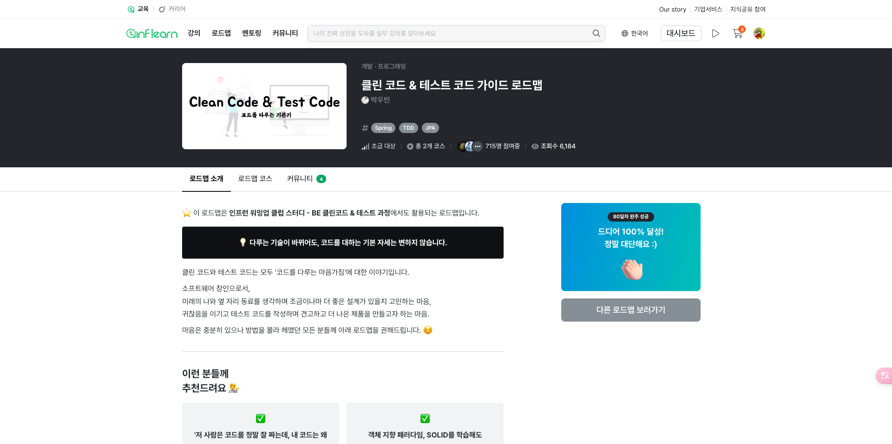
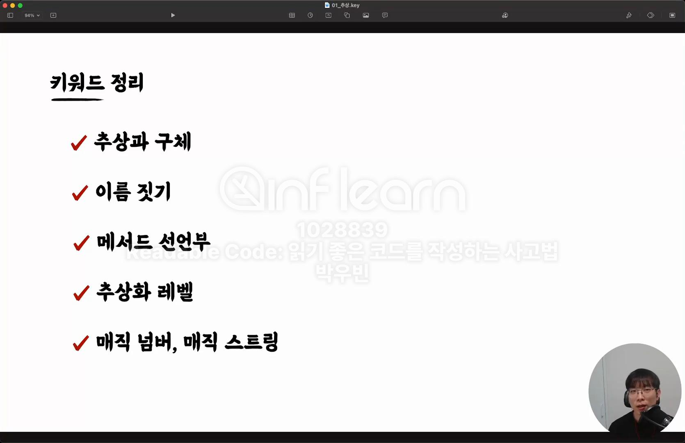
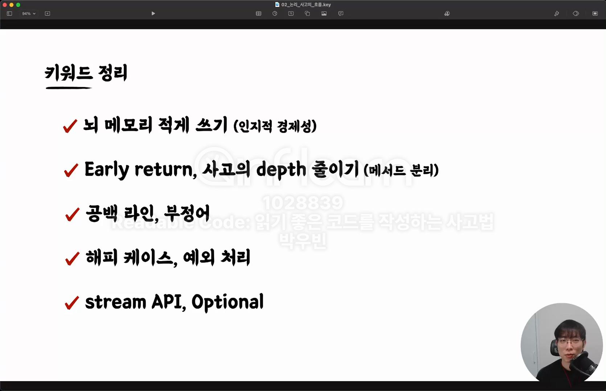
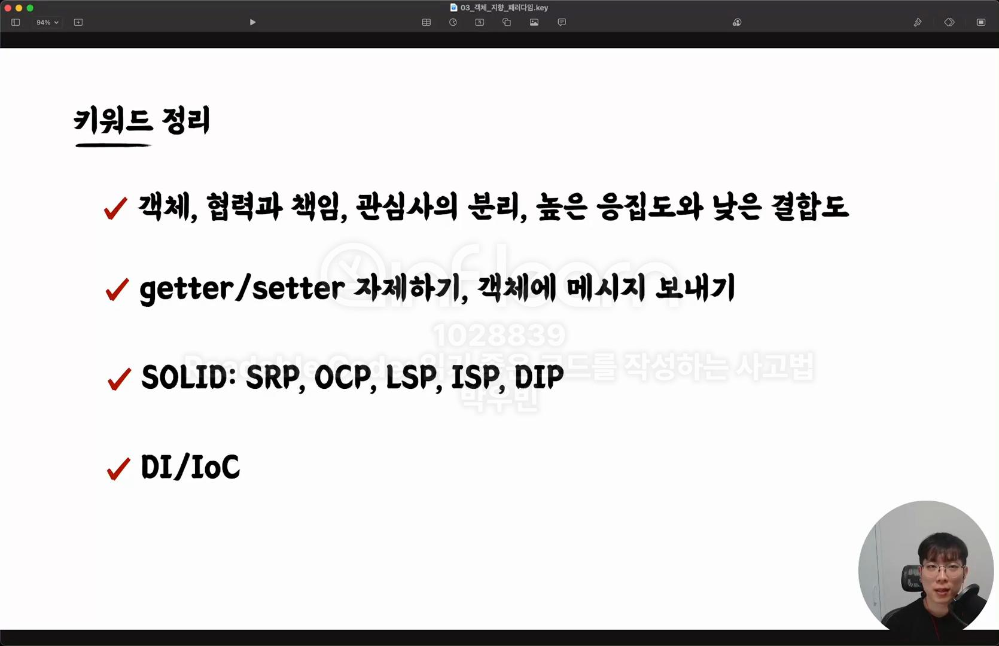
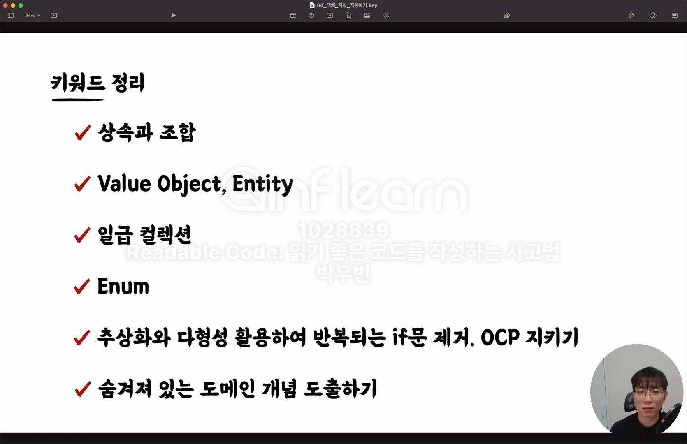
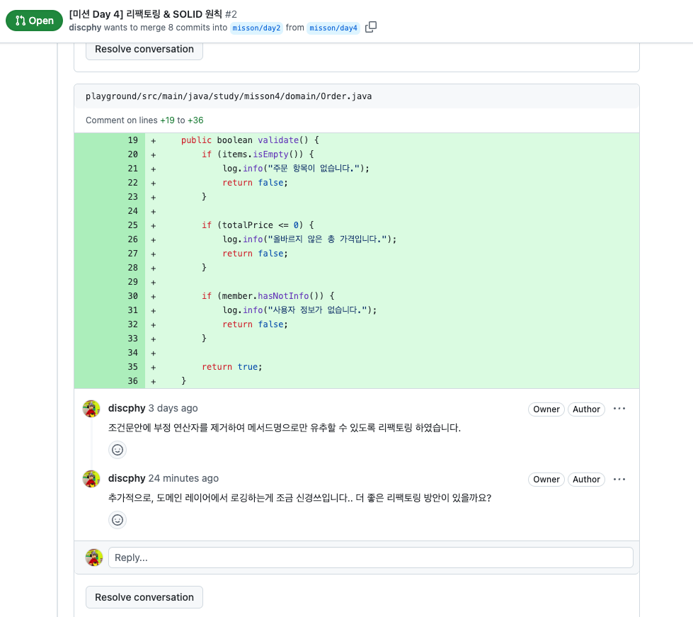

# 발자국 - Week1

## 🤔 인프런 워밍업 클럽 스터디 신청 계기

나는 인프런 워밍업 클럽 스터디 신청하기 한 달 전에 스터디 과정에 쓰이는 로드맵 강의를 이미 완강하였다.   
그럼에도 불구하고 강의를 수강하기 전부터 우빈님의 팬(?)이였기 때문에 이메일을 받자마자 신청을 할 수 밖에 없었다.

[항해 플러스 8기 백엔드 과정](https://hanghae99.spartacodingclub.kr/plus/be?utm_source=google&utm_medium=bs&utm_campaign=hhplus&utm_content=brand&utm_term=%ED%95%AD%ED%95%B4%20%ED%94%8C%EB%9F%AC%EC%8A%A4&gcl_keyword=%ED%95%AD%ED%95%B4%20%ED%94%8C%EB%9F%AC%EC%8A%A4&gcl_network=g&gad_source=1&gclid=CjwKCAiArKW-BhAzEiwAZhWsIHBY1ht4DYDg2CpAa0dy2ZcyVV1ZlSrvEF4YWGEqXUIZ77VdtqrTExoCcm4QAvD_BwE)을 앞두고 약 2주간 겹치는 구간이 있어 잠시나마 고민을 하긴 했지만?..  
복습 차원에서 미션과 발자국을 통해 학습내용을 더 딥하게 파고들어 성장하고자 신청하게 되었다.



## 👣 발자국이란? 

인프런 워밍업 클럽에서 이야기하는 **발자국**이란 다음과 같다.

> 주 1회, 일주일 동안 배운 내용을 바탕으로 남기는 학습 일기이자 회고이다.  
> 매주 강의를 요약하고 기록하면서 강의 내용을 제대로 이해했는지 확인하고, 보완할 부분을 찾는다.  
> 기록을 통해 배운 내용에 대해 메타인지 하는 시간을 가진다.

나는, 이번 과정에서는 강의를 재수강하지는 않고  
섹션 별로 우빈님께서 제공해주신 **키워드 정리**를 통해 학습을 진행할 예정이다.

## 💡 자기만의 언어로 키워드 정리하기 

### 섹션 2. 추상

+ 추상과 구체 : 이름 짓기 + 메서드 선언부 = 추상화 행위
    + 실제 코드를 작성하다보면 이름 짓기에 시간을 가장 많이 투자한다. 
    + 이름 짓기의 중요성이 크기 때문에 반복되는 훈련을 통해 이름 짓기의 스킬 향상이 필요해 보인다.

+ 추상화 레벨
    + 메서드를 추출하는 과정에서 외부셰계와 내부세계가 분리가 되고, 이 과정에서 추상화 레벨을 잘 고려해야한다. 
    + 추상화 레벨이 동등해야 자연스럽게 코드가 읽힌다.

    [다른 추상화 레벨]
    ```java
    public class Order {
        
        public void process() {
            paymentService.pay(); // 고수준 추상화 📈
            System.out.println("결제 완료"); // 저수준 추상화 📉 
        }
    }
    ```
    
    [동등한 추상화 레벨]
    
    ```java
    public class Order {
    
        public void process() {
            paymentService.pay(); // 고수준 추상화 📈
            printCompletedPay(); // 메서드를 분리하여 고수준의 추상화를 동등하게 유지 ✅
        }
    
        private void printCompletedPay() {
            System.out.println("결제 완료");
        }
    }
    ```    

+ 매직 넘버 + 매직 스트링 : 상수 혹은 Enum을 활용하여 이름 짓기를 통해 가독성이 좋아지게 한다.



### 섹션 3. 논리, 사고의 흐름

+ 뇌 메모리 적게 쓰기 (인지적 경제성)
    + 읽기 좋은 코드는 읽는 사람으로 부터 뇌를 편안하게 한다. 
    + 반대로 읽기 힘든 코드는 읽는 사람의 뇌를 피곤하게 한다.
  
+ Early return : Early return은 아래쪽 내용을 읽을 필요 없어 뇌 메모리 적게 쓰기에 효과적이다.

+ 사고의 depth 줄이기
    + 중첩 분기문가 중첩 반복문을 무조건 depth를 줄이기보다, 추상화를 통한 사고의 depth를 줄이는 것이 중요하다.
    + 사용할 변수는 가깝게 선언한다.

+ 공백 라인 : 공백 라인도 리팩토링 시 중요한 요소이다. 공백 라인이 존재하지 않은 코드는 읽기 어렵다. 

+ 부정어
    + 부정연산자는 가독성을 해친다. 여러 번의 사고를 거치면서 코드를 읽어야 한다. 
    + 한 번에 사고할 수 있도록 부정연산자를 제거하고 메서드로 추출했다면 이름 짓기를 적절하게 수정해야한다.

+ 해피 케이스, 예외 처리
    + 해피 케이스보다 예외처리에 더 신경써서 코드를 작성해야 한다. 
    + 예외는 의도하지 않은 예외랑 의도한 예외가 있다.



### 섹션 4. 객체 지향 패러다임

+ 객체, 협력과 책임, 관심사의 분리, 높은 응집도와 낮은 결합도 
    + 협력과 책임 : 객체간의 협력, 객체가 담당하는 책임
    + 관심사의 분리 : 관심사에 따라 객체를 만들어 낼 수 있다.
    + 높은 응집도 : 특정한 관심사로만 이루어진 설계
      
        [낮은 응집도]
        ```java
        public class OrderService {
            
            public Order createOrder(Product product) {
                // 주문 생성 로직 
            }
            
            public void sendEmail(Order order) {
                // 이메일 전송 로직은 OrderService의 관심사가 아니다. ❌
            }
        }
        ```
        
        [높은 응집도로 해결]
        
        **객체를 분리함으로써 응집도가 올라간다.**
        
        ```java
        public class OrderService {
            
            public Order createOrder(Product product) {
                // 주문 생성 로직 
            }
        }
        
        public class OrderEmailSender { // 객체를 분리하여 높은 응집도로 설계 ✅
        
            public void sendEmail(Order order) {
                // 이메일 전송 로직
            }
        }
        ```
      + 낮은 결합도 : 각 관심사끼리는 독립적이여야 한다.
        
          [높은 결합도]
          ```java
          public class OrderService {
            
              private EmailService emailService = new EmailService(); // 높은 결합도 ❌
          }
          ```
        
          [낮은 결합도로 해결]
        
          인터페이스와 DI를 활용하여 결합도를 낮춘다. 
        
          ```java
          public interface EmailSendable {
        
          }
        
          public class OrderEmailSender implements EmailSendable {
        
          }
        
          public class OrderService {
            
              private final EmailSendable emailSendable;
            
              public OrderService(EmailSendable emailSendable) {
                  this.emailSendable = emailSendable; // 높은 결합도를 해결한다. ✅
              }
          }
          ```
    
        > 객체끼리의 협력과 책임을 통해 프로그램을 만들 수 있다.    
          가장 중요한 것은 관심사의 분리이고 높은 응집도와 낮은 결합도를 가진 설계를 가지는 것이 중요하다.

+ getter/setter 자제하기, 객체에 메시지 보내기
    + setter는 최대한 지양하는 것이 좋다.
    + getter를 남발하는 건 객체를 존중하지 않는 것이며 무례하면서 폭력적인 행위이다.

+ SOLID: SRP, OCP, LSP, ISP, DIP 
    + **아래의 미션 Day 4 과정**에 대한 내용을 통해 자세히 다룬다. 
    
+ DI/IoC 



### 섹션 5. 객체 지향 적용하기

+ 상속과 조합 : 상속은 결합도가 높기 때문에 조합을 활용하는 것이 더 좋은 설계이다.

+ Value Object, Entity
    + VO는 불변성, 동등성, 유효성을 보장해야하며 도메인의 개념을 추상화한 객체이다. (ex. Money 객체)
    + Entity는 식별자가 존재한다. 식별자가 같으면 동등한 객체로 취급한다. 

+ 일급 컬렉션 : 컬렉션을 Wrapping한 객체를 뜻한다. 컬렉션을 추상화하여 의미를 담을 수 있고, 가공 로직의 보금자리가 생긴다. (VO와 비슷하다.)

+ Enum : 상수의 집합, 상수들에 대한 로직을 담을 수 있다. 

+ 추상화와 다형성 활용하여 반복되는 if문 제거 -> OCP 지키기  
    + 변하는 것 : 조건 & 행위 (구체)
    + 변하지 않는 것 : 조건을 만족하는가? / 행위를 수행한다. (추상)

    > 변하는 것과 변하지 않은 것을 구분해서 보는 훈련이 필요하다.

+ 숨겨져 있는 도메인 개념 도출하기 : 변경이 많이 일어날 것 같은 미래를 예견하고 이런 것을 도입해보면 어떨까? 하고 숨겨진 도메인 개념을 도출
    + 도메인 지식은 만드는 것이 아니라 발견하는 것이다.
    + 객체지향은 흉내내는 것이다. 
    + 미래를 예견하고 도메인 개념을 도출해보자. 

    [이메일 전송 개념에서 미래를 예견하고 숨겨진 도메인 개념을 도출]
    
    현재의 최선에서는 이메일만 발송하지만 미래에 카카오톡 알림톡이나 혹은 다른 알림에 대한 도메인 개념을 도출해보자 
    
    ```java
    public interface Sendable { // 미래를 예견하고 도매인 개념을 도출 ✅
        
        void send(String message);
    }
    
    public interface EmailSendable extends Sendable { 
     
        @Override
        void send(String message);
    }
    ```



## 👨🏻‍💻 미션 회고

### [미션 Day 2]

**[미션 PR]**   
https://github.com/discphy/warm-up-backend-code/pull/1

**1️⃣ 추상과 구체 예시**

강의 내용에서도 계속 등장하듯이 **추상**과 **구체**는 이번 강의에서 가장 핵심이 되는 단어들이다.   
이 미션을 접했을 때, 단순히 추상과 구체에 대한 예시를 들기보다 개발적인 관점에서 추상과 구체에 대해 접근하려고 노력했다. ~~(적절한 예시인지는 잘 모르겠으나..😂)~~

해당 미션을 통해, 추상화가 단순히 쉽지 않다는 걸 느꼈으며 개발적인 관점에서도 더 읽기좋은 코드를 작성하기 위해선 추상화를 잘 해야겠다라는 생각이 들었다.

### [미션 Day 4] 

**[미션 PR]**   
https://github.com/discphy/warm-up-backend-code/pull/2

**1️⃣ `validateOrder` 메서드를 읽기 좋은 코드로 리팩토링 하기**

+ 해당 메서드를 봤을 때는 엄청 어지러웠다.. 🤣 본능적으로 빨리 리팩토링 하고 싶다는 생각이..
+ 추상화 기법들을 통해 도메인 객체를 분리하고 도메인 내부세계로 검증 로직을 구현하였다. 
+ 객체 분리 : 일급 컬렉션으로 의미있는 `Items`의 객체로 분리하였고, `Member`라는 객체를 생성하여 `customerInfo`에 대한 검증 로직을 구현하였다.  
+ 사고의 depth 줄이기, 부정 연산자 지양 : 중복 분기문과 부정 연산자를 포함한 조건식을 리팩토링하여 읽는 사람으로 하여금 뇌 메모리 적게 쓰게 끔 리팩토링했다. 

미션 PR에도 코멘트를 달았지만 도메인 레이어의 로깅이 하는 구현 부가 포함된 게 신경이 쓰인다.  
도메인 레이어에서 의존성을 주입받지는 않아 객체 분리가 맞는지 모호하다.



[기존 코드]

```java
public boolean validateOrder(Order order) {
    if (order.getItems().size() == 0) {
        log.info("주문 항목이 없습니다.");
        return false;
    } else {
        if (order.getTotalPrice() > 0) {
            if (!order.hasCustomerInfo()) {
                log.info("사용자 정보가 없습니다.");
                return false;
            } else {
                return true;
            }
        } else if (!(order.getTotalPrice() > 0)) {
            log.info("올바르지 않은 총 가격입니다.");
            return false;
        }
    }
    return true;
}
```

[리팩토링 이후 코드]
```java
public class Order {

    private static final Logger log = Logger.getLogger(Order.class.getName());

    private final Items items;
    private final Member member;
    private final int totalPrice;

    private Order(Items items, Member member, int totalPrice) {
        this.items = items;
        this.member = member;
        this.totalPrice = totalPrice;
    }

    public boolean validate() {
        if (items.isEmpty()) {
            log.info("주문 항목이 없습니다.");
            return false;
        }

        if (totalPrice <= 0) {
            log.info("올바르지 않은 총 가격입니다.");
            return false;
        }

        if (member.hasNotInfo()) {
            log.info("사용자 정보가 없습니다.");
            return false;
        }

        return true;
    }
}
```

**2️⃣ SOLID에 대하여 자기만의 언어로 정리**

사실, 객체 지향에 대해 학습한 사람들 중 SOLID를 모르는 사람은 없을 것 이다.   
그치만 여기서의 포인트는 **자기만의 언어**이다. 


위에서도 강의에 대한 정리내용을 작성할 때 **"💡 자기만의 언어로 키워드 정리하기"** 라는 제목으로 작성하였다.   
학습한 내용을 온전히 내 것으로 만들기 위해선 반드시 **나의 언어**로 작성해야 내 것이 되고, 차후에 정리한 내용을 다시 봤을 때도 금방 기억을 더듬을 수 있을 것 이다.

그래서 나는 텍스트 보다 코드로 봤을 때의 이해도가 더 빠르기 때문에 SOLID 원칙의 내용을 정리할 때 불필요한 텍스트를 줄이고 코드로 내용을 정리하였다.

## 🏃 돌아보며..

위에서도 언급했지만, 항해 플러스 백엔드 스터디 2개도 병행하고 있어 참여를 망설였지만.. 신청하기 잘한 것 같다.  
(2기가 마지막이 될까봐 조마조마 했던 1인.. 우빈님 감사합니다.. 🙇‍♂️) 

온라인 밋업을 통한 우빈님과 소통하는 것도 그렇고..   
여러가지 미션의 내용도 단조롭지 않고 수준이 높은 것 같아 다시 한번 메타인지를 경험하게 해준다.

강의의 경우, 시간상 처음부터 끝까지 다시 보지는 못하겠지만.. 불과 몇 개월 전 수강한 강의임에도 단어들이 어색하다... 😂  
어색했던 부분은 다시 강의를 보며 이해하고 보완하였다. 


**읽기 좋은 코드**를 작성하기 위해 학습한 내용을 기반으로 적절한 추상화를 적용하는 훈련을 하며 내 코드가 **읽기 좋은 코드**가 되도록 노력해야겠다.

[출처]
+ 인프런 워밍업 클럽 : https://www.inflearn.com/course/offline/warmup-club-3-be-code   
+ 강의 : https://www.inflearn.com/course/readable-code-%EC%9D%BD%EA%B8%B0%EC%A2%8B%EC%9D%80%EC%BD%94%EB%93%9C-%EC%9E%91%EC%84%B1%EC%82%AC%EA%B3%A0%EB%B2%95/dashboard

