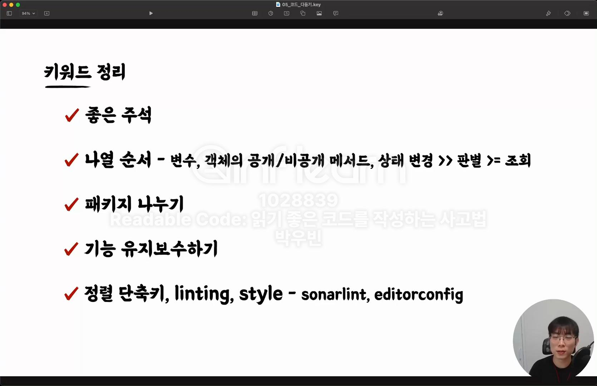
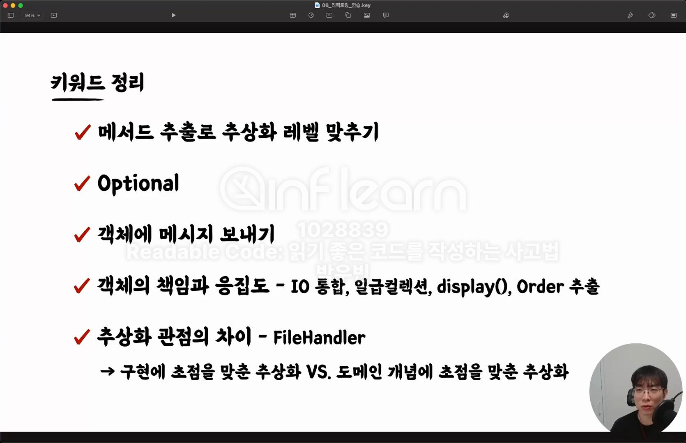
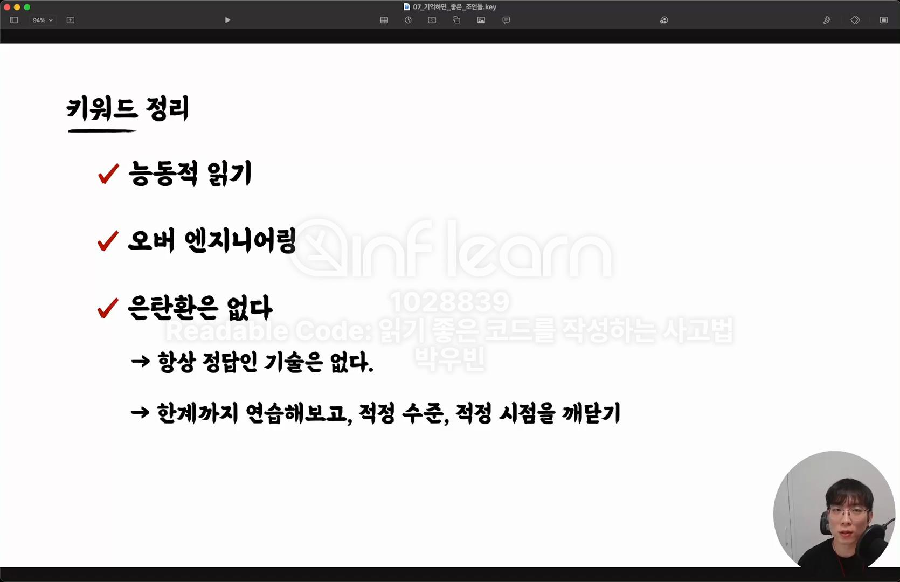
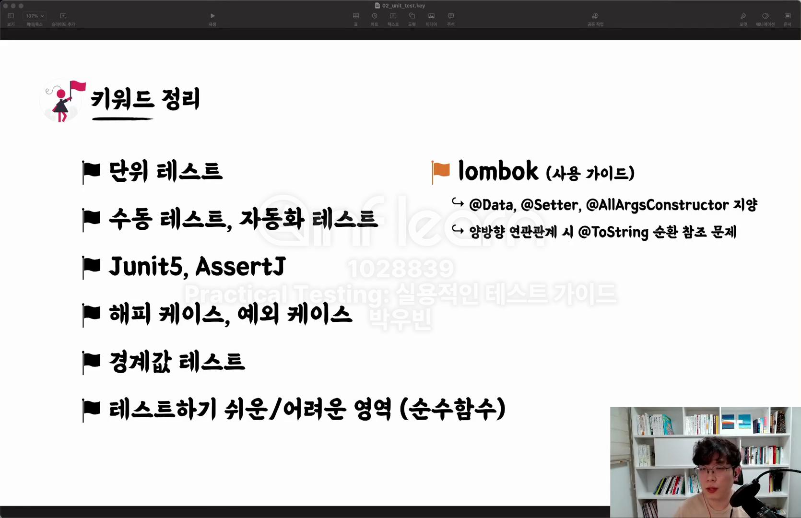
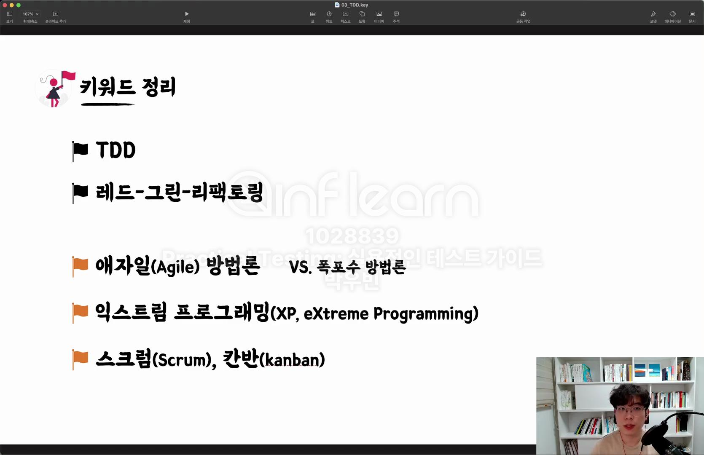
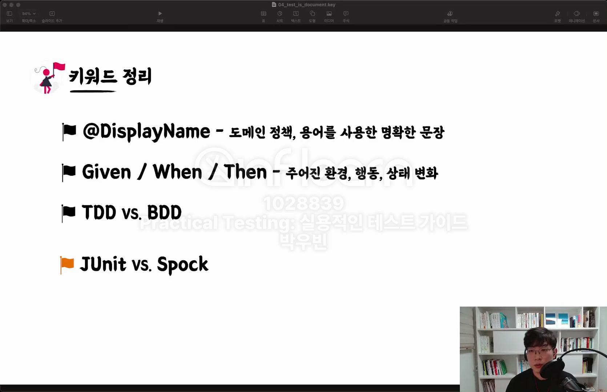

# 발자국 - Week2

## 💡 자기만의 언어로 키워드 정리하기   

### 섹션 6. 코드 다듬기

**좋은 주석 - 주석의 양면성**
+ 주석이 많다는 것 : 추상화가 덜 되고 가독성이 좋지 않은 코드 (코드 품질 저하 📉)
+ 주석이 필요한 경우 : 히스토리를 알 수 없을 경우, 주석으로 상세히 설명
  
**변수와 메서드 나열 순서**
+ 변수 : 사용하는 순서대로 위치한다. (인지적 경제성 / 뇌 메모리 줄이기)
+ 객체의 공개/비공개 메서드 : 공개 메서드를 상단에 위치하고, 비공개 메서드 하단에 위치한다. 공개 메서드 중에서도 중요도의 순서에 따라 배치한다.
  + 공개 메서드 : 객체의 상태를 변경 하는 부분이 가장 상단에 위치하도록 - 상태 변경 >>> 판별 >= 조회
  + 비공개 메서드 : 출현한 순서대로
    
**패키지 나누기** 
+ 여러 파일들의 네임 스페이스를 관리하기 때문에 적당한 수준으로 잘 나누어야 한다.
+ 대규모 패키지 변경은 팀원과의 합의 필요 -> 추후 conflict가 생길 수 있다.
  
**기능 유지보수하기**

**정렬 단축키, linting, style - sonarlint, editorconfig** 

### 섹션 7. 리팩토링 연습

**메서드 추출로 추상화 레벨 맞추기** 

**Optional**
+ return null / Optional 파라미터 사용은 안티패턴이다.  

**객체에 메시지 보내기**
+ 객체를 존중하고 메시지를 보내자.

**객체의 책임과 응집도**

**⭐️ 추상화 관점의 차이 - FileHandler**
+ 구현에 초점을 맞춘 추상화 VS 도메인 개념에 초점을 맞춘 추상화
+ File을 read 하는 부분의 로직들은 전부 FileHandler에 들어갈 것이다. 잘못된 객체 응집일 수도 있다.. 
+ 방법에 초점을 맞춘 설계 방식이 아닌 어떤 데이터를 가져오는 가에 대한 초점을 맞추는 것이 좋다.

### 섹션 8. 기억하면 좋은 조언들

**능동적 읽기** 
+ 가지고 있는 리팩토링 기법들을 총동원해서 읽자. -> 리팩토링하면서 읽기
+ 눈으로만 보는 수동적 읽기는 권장하지 않는다. 
+ 도메인 지식을 늘리기 위해서 능동적 읽기가 필요하다. (작성자의 의도 파악)

**오버 엔지니어링**
+ 필요한 적정 수준보다 더 높은 수준의 엔지니어링
+ 예시 1. 구현체가 하나인 인터페이스 
  + 구현체가 수정할 때마다 인터페이스도 수정해야 함
  + 코드 탐색의 어려움 
+ 예시 2. 너무 이른 추상화 
  + 정보가 숨겨지기 때문에 복잡도가 높아진다. 
  + 후대 개발자들이 선대의 의도를 파악하기가 어렵다. 

**은탄환은 없다**
+ 클린 코드도 은탄환이 아니다. 
+ 실무에서의 줄다리기 
  + 지속 가능한 소프트웨어 품질 VS 기술 부채를 안고 가는 빠른 결과물 -> 클린 코드를 대비한 코드 센스가 필요하다.
+ 모든 기술과 방법론은 적정 기술의 범위 내에서 사용되어야 한다.
+ 항상 정답인 기술은 없다. 
+ 한계까지 연습해보고, 적정 수준, 적정 시점을 깨닫는 것이 필요하다. 

### 섹션 3. 단위 테스트 

**단위 테스트**
+ **작은** 코드(클래스 또는 메서드) 단위를 **독립적**으로 검증하는 테스트 -> 가장 기본이 되는 테스트 
+ 검증 속도가 빠르고, 안정적

**수동 테스트, 자동화 테스트 -> 인지 필요**
+ 사람이 검증하는 수동 테스트 -> `sout`으로 출력하고 눈으로 직접 확인
+ 기계가 검증하는 자동화 테스트 

**Junit5, AssertJ**
+ Junit5 : 단위 테스트를 위한 테스트 프레임워크
+ AssertJ : 테스트 코드 작성을 원할하게 돕는 테스트 라이브러리 - 풍부한 API 메서드 체이닝 지원 

**해피 케이스, 예외 케이스 -> 테스트 케이스 세분화**
+ 예외 케이스 : 암묵적 혹은 드러나지 않은 요구사항에서 발견

**경계값 테스트**
+ 범위, 구간, 날짜 경계값들로 테스트를 해야한다.

**테스트하기 쉬운/어려운 영역 (순수함수)**
+ 테스트 하기 어려운 영역을 구분하고 분리하기 
+ 외부로 분리할수록 테스트 가능한 코드는 많아진다.
+ 테스트하기 어려운 영역
  + 관측할 때마다 다른 값에 의존하는 코드 : 현재 날짜/시간, 랜덤 값, 전역 변수/함수, 사용자 입력 
  + 외부 셰계에 영향을 주는 코드 : 표준 출력, 메시지 발송, 데이터베이스에 기록하기
+ 순수 함수 - 테스트하기 쉬운 영역
  + 같은 입력에는 항상 같은 결과 
  + 외부 세상과 단절된 형태

**lombok** 
+ @Data, @Setter, @AllArgsConstructor 지양
+ 양방향 연관관계 시 @ToString 순환 참조 문제

### 섹션 4. TDD: Test Driven Development 

**TDD** 
+ 테스트 주도 개발 (Test Driven Development)로, 프로덕션 코드보다 테스트 코드를 먼저 작성하여 테스트가 구현 과정을 주도하도록 하는 방법론
+ 선 기능 구현, 테스트 작성의 문제점 (일반적인 개발) - 구현순서 : 기능 -> 테스트
  - 테스트 자체의 누락 가능성
  - 해피 케이스만 검증할 가능성
  - 잘못된 구현을 다소 늦게 발견할 가능성
+ 선 테스트 작성, 기능 구현 (TDD) - 구현순서 : 테스트 -> 기능
  - 복잡도(유연하며 유지보수가 쉬운)가 낮은 테스트 가능한 코드로 구현할 수 있게 한다.
  - 테스트가 힘든 코드를 위한 코드 작성이 가능
  - 예를 들면 LocalDateTime.now()의 경우 외부세계로 분리해서 테스트를 하기 편한 코드를 작성할 수 있다.
  - 프로덕션 코드를 작성한 후 테스트 코드를 작성하기 귀찮을수도..
  - 쉽게 발견하기 어려운 엣지 케이스를 놓치지 않게 해준다.
  - 구현에 대한 빠른 피드백을 받을 수 있다.
  - 과감한 리팩토링이 가능해진다.
  - 테스트 코드가 보장
+ TDD의 관점
  + 이전의 관점 : 테스트는 구현부 검증을 위한 보조 수단
  + 변화된 관점 : 테스트와 상호 작용하며 발전하는 구현부

**레드 - 그린 - 리팩토링** 
1. Red : 실패하는 테스트 작성
2. Green : 테스트 통과 하는 최소한의 코딩
3. Refactor : 구현 코드 개선 테스트 통과 유지

**애자일 방법론 vs 폭포수 방법론**
+ 애자일 방법론 https://agilemanifesto.org/iso/ko/manifesto.html
  + 반복적 개발(Iterative Development): 짧은 개발 주기(스프린트)를 반복하며 지속적으로 개선.
  + 유연성: 요구사항 변경을 수용할 수 있도록 유동적으로 진행.
  + 고객 참여: 개발 과정에서 지속적인 피드백을 반영하여 사용자 중심 개발 가능.
  + 자율적인 팀 구성: 개발팀이 자체적으로 의사 결정을 하며, 빠르게 문제를 해결함.
+ 폭포수 방법론
  + 단계적 개발: 요구 분석 → 설계 → 구현 → 테스트 → 배포 → 유지보수 순서로 진행됨.
  + 문서 중심: 각 단계마다 문서화가 철저하게 이루어짐.
  + 선형 구조: 이전 단계가 완료되어야 다음 단계로 넘어갈 수 있음.
  + 변경이 어려움: 초기에 요구사항을 확정하면 이후 변경이 어렵고 비용이 많이 듦.

**익스트림 프로그래밍**   
+ XP(Extreme Programming, 익스트림 프로그래밍)는 애자일 방법론 중 하나로, 빠른 개발 주기와 지속적인 피드백을 중심으로 하는 소프트웨어 개발 방법론이다. 
고객의 요구사항 변화에 빠르게 대응할 수 있도록 짧은 개발 반복 주기(Iteration)와 강한 협업 문화를 강조한다.

**스크럼, 칸반**
+ 스크럼  
  > 애자일 프레임워크로, 일정한 스프린트 동안 작업을 계획하고 진행하는 반복적이고 점진적인 개발 방식이다.  
  > 짧은 개발 스프린트를 통해 빠르게 결과물을 만들고 지속적으로 개선하는 것이 핵심이다.
  
  1️⃣ 백로그 작성 – 제품 백로그에 모든 요구사항을 정리  
  2️⃣ 스프린트 계획 – 스프린트 기간 동안 수행할 작업 선정  
  3️⃣ 스프린트 진행 – 개발 진행 및 매일 스탠드업 미팅  
  4️⃣ 스프린트 리뷰 – 개발 완료된 기능을 검토  
  5️⃣ 회고(Retrospective) – 개선점을 찾고 다음 스프린트에 반영

+ 칸반   
  > Workflow와 가시성을 중심으로 한 애자일 프레임워크로, 지속적인 개선과 작업량 관리를 중점적으로 다룬다.  
  > 작업을 시각적으로 표현하여 현재 진행 상황을 쉽게 파악할 수 있도록 합니다.

  1️⃣ Backlog: 해야 할 작업을 모아둠  
  2️⃣ To Do: 현재 진행할 작업  
  3️⃣ In Progress: 진행 중인 작업  
  4️⃣ Review/Test: 리뷰나 테스트가 필요한 작업  
  5️⃣ Done: 완료된 작업

### 섹션 5. 테스트는 []다.

**테스트 코드는 문서다.**
+ 프로덕션 기능을 설명해주는 것이 테스트 코드 문서다. 
+ 다양한 테스트 케이스를 통해 프로덕션 코드를 이해하는 시각과 관점을 보완할 수 있다. 
+ 고민했던 내용(테스트 코드)을 팀 자산(소스 코드)으로 공유할 수 있다. 

**@DisplayName - 도메인 정책, 용어를 사용한 명확한 문장** 
+ 메서드명만으로 어떤 것을 검증하고자 하는 의도 파악이 어려움
+ Junit5에 추가한 어노테이션이다.
+ 문장 형태로 섬세하게 테스트 검증에 대한 내용을 어노테이션안에 작성한다.
+ 섬세한 DisplayName
  + 특정 시간 이전에 주문을 생성하면 실패한다. ❌
  + 영업 시작 시간 이전에는 주문을 생성할 수 없다. ✅
    + 도메인 용어를 사용하여 추상화된 내용을 담기 -> 메서드 자체의 관점 보다 도메인 정책 관점 (특정 시간 -> 영업 시작 시간 ✅)
    + 테스트의 현상을 중점으로 기술하지 말 것 (~실패한다 ❌)
  
**Given / When / Then - 주어진 환경, 행동, 상태 변화**
+ Given : 시나리오 진행에 필요한 모든 준비 과정 
+ When : 시나리오 행동 진행 
+ Then : 시나리오 진행에 대한 결과 명시, 검증

**TDD vs BDD**
+ BDD
  + TDD에서 파생된 개발 방법
  + 시나리오 기반한 테스트 케이스 자체에 집중하여 테스트한다.
  
**Junit vs Spock**
+ Spock은 Groovy언어로 BDD 패턴을 적용해서 테스트 코드를 작성할 수 있다.
  
**언어가 사고를 제한한다.**
+ 명확하지 못한 테스트 코드는 사고를 제한할 수 있다. 
+ 문서로서의 테스트를 신경 쓸 필요가 있다.

