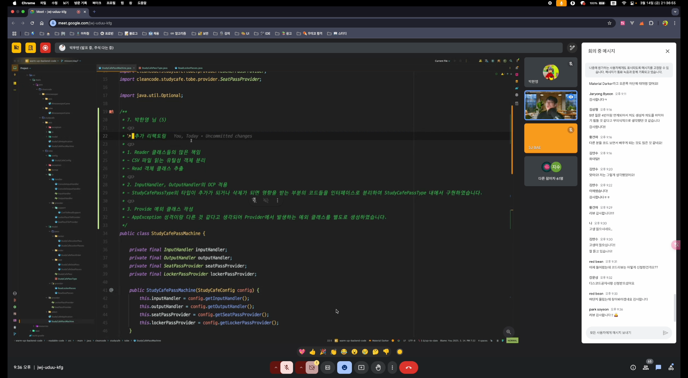
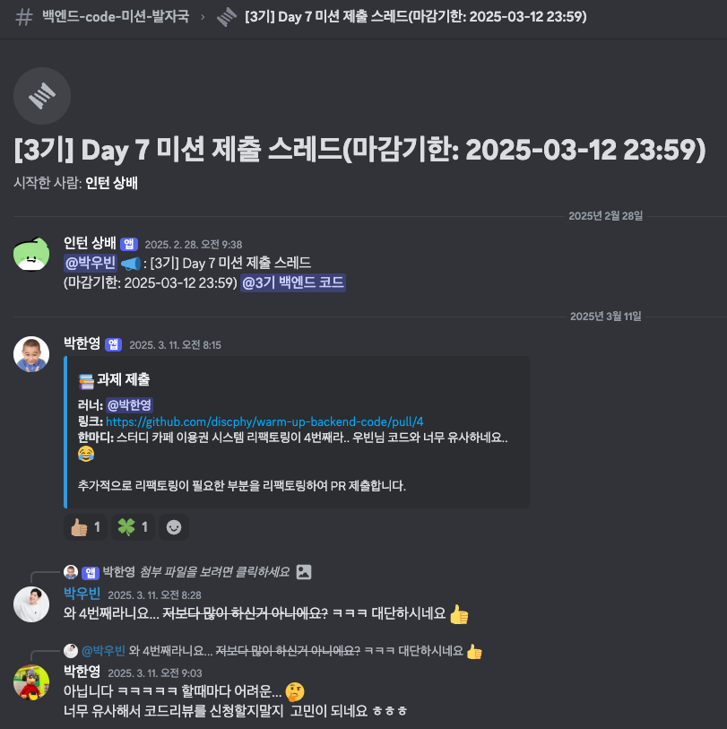
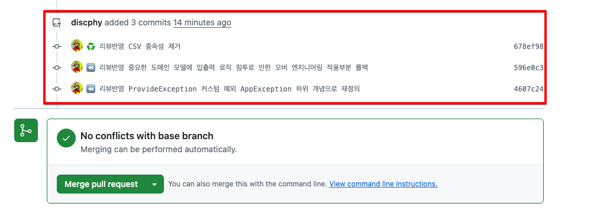

# 발자국 - Week2

## 🙊 시작이 반이다... 벌써 중간점검 ?

인프런 워밍업 클럽이 시작한지 2주가 지났다.. 앞으로 남은 발자국이 2개 뿐이다.. 👣

이번주에는 중간점검으로 온라인 라이브가 진행 되었다. 
온라인 라이브에 대한 내용은 다음과 같다. 

- [미션 Day 4](https://github.com/discphy/warm-up-backend-code/pull/2 ) 에 대한 공통 피드백
- Q&A에 대한 답변 
- [미션 Day 7](https://github.com/discphy/warm-up-backend-code/pull/4) 코드리뷰 진행 

각 세션은 놀라울 정도의 **세심한** 우빈님의 피드백 덕분에 많은 인사이트를 얻게 되어 좋은 시간이었다. 
나도 **첫번째**로 코드리뷰를 신청하고 라이브 **마지막**에 코드리뷰를 받았는데 너무 좋은 경험이었다. 💪

(커피를 좋아하시기로 유명한 우빈님께 Q&A 세션 도중 저가 커피 브랜드 중 어디 브랜드가 제일 맛있냐는 질문이 나왔는데.. 드셔 보신 적이 없다고 답변해 주신 부분이 인상적이었다.. ㅋㅋ 😁)



## ✨ 우빈님의 세심한 코드 리뷰

위에서 이야기했듯이 코드리뷰를 첫번째로 신청해서 우빈님께 온라인 라이브 시간에 코드리뷰를 받았다. 

해당 미션은 **"스터디 카페"** 프로그램을 리팩토링하는 미션이였는데.. 
작년 4분기에 강의를 수강했을 당시에 **3번**이나 진행하였다. 

- 첫 번째 리팩토링, 강의를 듣기 전에 리팩토링
- 두 번째 리팩토링, 강의를 수강하며 리팩토링 
- 세 번째 리팩토링, 강의를 수강 후 정리하며 다시 리팩토링 

이번이 **네 번째 리팩토링**이였는데 할 때마다 왜 새로운 것인지.. 🥲

그래도 손이 기억이라도 한 듯 나름 ~~순조롭게(?)~~ 미션을 진행하게 되었고, 추가적으로 리팩토링을 진행하였고 해당 부분을 리뷰를 받고 싶어 신청하게 되었다. 

(우빈님께서 4번이라는 부분에 놀라셨는지(?).. 디스코드 스레드에 댓글을 남겨주셨다! 🤣)



다시 돌아와서.. 코드리뷰 받은 내용은 아래와 같다.

### 1️⃣ 중요 도메인 StudyCafePassType의 구조화

**🔗 Github PR 링크**  
[StudyCafePassType 구조화 리팩토링](https://github.com/discphy/warm-up-backend-code/pull/4/files/212a43697bba43f87fe5c261d5fdc45bac93820b#diff-0441ab7ce9642ae6396303d893115c8cd948578e5b0ca8dcbeaaf5b3994849ad) 

**♻️ 리팩토링 코드**
```java
public enum StudyCafePassType implements PassTypeSelectable, PassTypeFormatter { // 📝 인터페이스 구조화

    HOURLY("시간 단위 이용권") {
        // 📝 사용자 입력에 대한 구조화
        @Override
        public boolean selected(String userInput) {
            return "1".equals(userInput);
        }

        // 📝 사용자 출력 포맷에 대한 구조화
        @Override
        public String format(StudyCafePass pass) {
            return String.format("%s시간권 - %d원", pass.getDuration(), pass.getPrice());
        }
    }
}
```

**✏ 우빈님 리뷰**
```
Q. 클래스 내부에서 사용자 입력값 및 출력값에 사용하는 인터페이스를 구현함으로써 오버 엔지니어링이 된 것 같은 느낌이 드네요.. 🤦‍♂️

A. 저도 그렇게 생각해요.. ㅋㅋㅋㅋ 

오버 엔지니어링이기보다 PassType은 중요한 도메인 모델인데, Input에서만 의미를 가지는 사용자 선택지가 침투하고 있다.

사용자 선택 방법이 "a", "b", "c"로 바뀐다면? 단순히 입력 방식을 바꿨을 뿐인데 무료 도메인 모델이 수정되어야 하는 엄청난 사태가 발생한다.  

항상 구조화를 하는 것이 정답은 아니다. 
Output format도 마찬가지이다.

책임이 우선이다. 적절한 책임의 분배가 객체의 결합도를 낮추고 응집도를 높이는 것이다.
```

**🤔 돌아보기**  

단순히, OCP를 적용하기 위해 접근해서 리팩토링 했었는데.. 

적절한 객체 책임 분리를 하지 못했으며, 
중요한 도메인 모델을 수정하는 엄청 큰 사이드 이펙트가 일어날 수 있다는 점을 간과 했다는 것이다. 

다음부터는 구조화를 남발하지 않고 책임에 집중해서 리팩토링 해야겠다.. 

### 2️⃣ 이용권을 읽는 부분과 읽은 부분의 개념을 추출하여 객체 분리

**🔗 Github PR 링크**  
[ReadLockerPasses 객체 분리](https://github.com/discphy/warm-up-backend-code/pull/4/files/212a43697bba43f87fe5c261d5fdc45bac93820b#diff-12130d87be6cae7cda34dcc1413657f39dceb5be55609d767ef700037058c346)

**♻️ 리팩토링 코드**
```java
public class ReadLockerPasses { // 📝 LockerPasses를 해석하는 객체 분리

    private final List<StudyCafeLockerPass> passes;

    private ReadLockerPasses(List<StudyCafeLockerPass> passes) {
        this.passes = passes;
    }

    // 📝 lines을 해석하여 List<StudyCafeLockerPass> 객체를 만들어준다. 
    public static ReadLockerPasses ofLines(List<String> lines) {
        List<StudyCafeLockerPass> passes = lines.stream()
            .map(ReadLockerPasses::ofLine)
            .toList();

        return new ReadLockerPasses(passes);
    }

    private static StudyCafeLockerPass ofLine(String line) {
        String[] values = line.split(CSV_SPLITTER); // ⭐️ CSV라는 방식에 종속적 

        StudyCafePassType studyCafePassType = StudyCafePassType.valueOf(values[0]);
        int duration = Integer.parseInt(values[1]);
        int price = Integer.parseInt(values[2]);

        return StudyCafeLockerPass.of(studyCafePassType, duration, price);
    }

    // 📝 StudyCafeLockerPasses를 생성해준다.
    public StudyCafeLockerPasses toPasses() {
        return StudyCafeLockerPasses.of(passes);
    }
}
```

**✏ 우빈님 리뷰**
```
Q. 일급 컬렉션을 적용하기 위해 toPasses() 메서드를 생성했는데
Read~라는 네이밍을 가진 클래스에 많은 책임이 부여된 것 같아 네이밍이 모호한 것 같습니다.

좋은 방법이 있을까요..? 🧐

A. 많은 책임이라고 생각하신 이유가 있을까요?

"ReadLockerPasses는 어디선가 읽은 lines를 가지고 StudyCafeLockerPasses를 만들어준다"의 책임으로 보여서, 어색하지 않으며 테스트 코드 작성도 가능하다.

그와 별개로 CSV라는 방식에 종속되어있다. CSV형식이 다른 방식으로 바뀌었을 때 같이 바뀌어야 하는 부분이 CSV_SPLITTER 부분이다. 의도한 것 이라면 상관없다.
```

**🤔 돌아보기**  

`Read`라는 클래스명을 가지고 있어 `StudyCafeLockerPasses`를 생성해주는 메서드가 존재해 많은 책임이 있다고 생각했는데..   
우빈님 리뷰 이후에 다시 보니.. 그렇게 어색한가 싶기도 하다.. ㅎㅎ

해당 클래스의 작성 당시 CSV 방식을 의존하려는 의도는 없었다. 
단순히 **읽은** 부분의 개념을 추출한 것인데.. 위의 클래스는 `CSV_SPLITTER`상수가 사용되어 의도하지 않게 CSV라는 방식에 종속적이게 된 것이다. 

CSV라는 방식이 변경되면 객체 로직이 바뀌어야 한다. 

객체 구현 시, 종속성에 대해서 방어적으로 접근할 필요가 있어보인다.

### 3️⃣ ProvideException 커스텀 예외 

**🔗 Github PR 링크**  
[ProvideException 커스텀 예외](https://github.com/discphy/warm-up-backend-code/pull/4/files/212a43697bba43f87fe5c261d5fdc45bac93820b#diff-7e98a3b1f2509ce92ca9f34063ed3c36466059f00fdba491e144e7509e5d3f8c)

**♻️ 리팩토링 코드**
```java
// 📝 이용권을 가져오는 과정에서 생긴 에러의 커스텀 예외 클래스 생성
public class ProvideException extends RuntimeException {

    public ProvideException(String message) {
        super(message);
    }
}

public class StudyCafePassMachine {

    public void run() {
        try {
            outputHandler.showPassOrderSummary(order);
        } catch (AppException e) {
            outputHandler.showSimpleMessage(e.getMessage());
        } catch (ProvideException e) {
            // 📝 커스텀 예외 catch
            outputHandler.showSimpleMessage("이용권을 제공받을 수 없습니다.");
        } catch (Exception e) {
            outputHandler.showSimpleMessage("알 수 없는 오류가 발생했습니다.");
        }
    }
}
```

**✏ 우빈님 리뷰**
```
Q. AppException 성격이랑 다른 것 같다고 생각되어 Provider 인터페이스에서 발생하는 예외 클래스 ProvideException를 별도로 생성하였습니다.

A. 혹시 어떻게 다르다고 생각셨나요?? 

AppException의 의도는, 프로그램에서 발생할 수 있는 대부분의 애플리케이션 상황을 정의하는 최상위 예외 클래스이다.

만약 ProvideException을 별도로 표기하여 더 구체적인 상황을 나타내고 싶으면, AppException을 상속받아서 구성해야 한다. 

그렇지 않으면 커스텀 예외 클래스가 늘어남에 따라 catch절도 같이 늘어날 것이다.

추가적으로, "이용권을 제공받을 수 없습니다."라는 메시지가 사용자 친화적이지 않다.
```

**🤔 돌아보기**  

리팩토링 당시, 초기 이용권을 가져와야만 프로그램이 실행된다는 관점에서 `ProvideException`의 커스텀 예외 클래스를 작성하였다. 

하지만 이용권을 가져오는 부분은 프로그램 내부에서 필요한 시점마다 호출하고 있어  
우빈님 리뷰대로 `AppException` 클래스를 상속받아서 작성하는 것이 더 나은 설계 같다.

예외 메세지도 사용자 관점에서는 친화적이지 않은 것이 분명하다.   
내가 키오스크 시스템을 사용하다가 저런 메세지를 마주한다면... 화가 날 것 이다... 😡

프로그램의 의도를 정확히 파악할 필요가 있어보인다. 또한 예외 메세지도 누가 보는지에 따라 고민해보는 습관을 길러야겠다.

---

이렇게, 요청한 3개의 리뷰와 2개의 추가 리뷰를 받아 보았다..  
고작 3일 만에 7명이나 리뷰를 해주셨는데 세심하고 또 세심했다... 퀄리티가 상당했다.. ✨

이번 온라인 라이브를 통해 우빈님에 대한 팬심과 존경심이 더욱 커졌다....! 📈  
리뷰해주신 내용으로 다시 리팩토링을 함으로써 한층 더 Readable Code에 대한 성장을 경험할 수 있었다. 🚀



## 💡 자기만의 언어로 강의 키워드 정리하기   

### 섹션 6. 코드 다듬기

**좋은 주석 - 주석의 양면성**
+ 주석이 많다는 것 : 추상화가 덜 되고 가독성이 좋지 않은 코드 (코드 품질 저하 📉)
+ 주석이 필요한 경우 : 히스토리를 알 수 없을 경우, 주석으로 상세히 설명
  
**변수와 메서드 나열 순서**
+ 변수 : 사용하는 순서대로 위치한다. (인지적 경제성 / 뇌 메모리 줄이기)
+ 객체의 공개/비공개 메서드 : 공개 메서드를 상단에 위치하고, 비공개 메서드 하단에 위치한다. 공개 메서드 중에서도 중요도의 순서에 따라 배치한다.
  + 공개 메서드 : 객체의 상태를 변경 하는 부분이 가장 상단에 위치하도록 - 상태 변경 >>> 판별 >= 조회
  + 비공개 메서드 : 출현한 순서대로
    
**패키지 나누기** 
+ 여러 파일들의 네임 스페이스를 관리하기 때문에 적당한 수준으로 잘 나누어야 한다.
+ 대규모 패키지 변경은 팀원과의 합의 필요 -> 추후 conflict가 생길 수 있다.
  
**기능 유지보수하기**

**정렬 단축키, linting, style - sonarlint, editorconfig** 


### 섹션 7. 리팩토링 연습

**메서드 추출로 추상화 레벨 맞추기** 

**Optional**
+ return null / Optional 파라미터 사용은 안티패턴이다.  

**객체에 메시지 보내기**
+ 객체를 존중하고 메시지를 보내자.

**객체의 책임과 응집도**

**⭐️ 추상화 관점의 차이 - FileHandler**
+ 구현에 초점을 맞춘 추상화 VS 도메인 개념에 초점을 맞춘 추상화
+ File을 read하는 부분의 로직들은 전부 FileHandler에 들어갈 것이다. 잘못된 객체 응집일 수도 있다.. 
+ 방법에 초점을 맞춘 설계 방식이 아닌 어떤 데이터를 가져오는 가에 대한 초점을 맞추는 것이 좋다.


### 섹션 8. 기억하면 좋은 조언들

**능동적 읽기** 
+ 가지고 있는 리팩토링 기법들을 총동원해서 읽자. -> 리팩토링하면서 읽기
+ 눈으로만 보는 수동적 읽기는 권장하지 않는다. 
+ 도메인 지식을 늘리기 위해서 능동적 읽기가 필요하다. (작성자의 의도 파악)

**오버 엔지니어링**
+ 필요한 적정 수준보다 더 높은 수준의 엔지니어링
+ 예시 1. 구현체가 하나인 인터페이스 
  + 구현체가 수정할 때마다 인터페이스도 수정해야 함
  + 코드 탐색의 어려움 
+ 예시 2. 너무 이른 추상화 
  + 정보가 숨겨지기 때문에 복잡도가 높아진다. 
  + 후대 개발자들이 선대의 의도를 파악하기가 어렵다. 

**은탄환은 없다**
+ 클린 코드도 은탄환이 아니다. 
+ 실무에서의 줄다리기 
  + 지속 가능한 소프트웨어 품질 VS 기술 부채를 안고 가는 빠른 결과물 -> 클린 코드를 대비한 코드 센스가 필요하다.
+ 모든 기술과 방법론은 적정 기술의 범위 내에서 사용되어야 한다.
+ 항상 정답인 기술은 없다. 
+ 한계까지 연습해보고, 적정 수준, 적정 시점을 깨닫는 것이 필요하다. 


### 섹션 3. 단위 테스트 

**단위 테스트**
+ **작은** 코드(클래스 또는 메서드) 단위를 **독립적**으로 검증하는 테스트 -> 가장 기본이 되는 테스트 
+ 검증 속도가 빠르고, 안정적

**수동 테스트, 자동화 테스트 -> 인지 필요**
+ 사람이 검증하는 수동 테스트 -> `sout`으로 출력하고 눈으로 직접 확인
+ 기계가 검증하는 자동화 테스트 

**Junit5, AssertJ**
+ Junit5 : 단위 테스트를 위한 테스트 프레임워크
+ AssertJ : 테스트 코드 작성을 원할하게 돕는 테스트 라이브러리 - 풍부한 API 메서드 체이닝 지원 

**해피 케이스, 예외 케이스 -> 테스트 케이스 세분화**
+ 예외 케이스 : 암묵적 혹은 드러나지 않은 요구사항에서 발견

**경계값 테스트**
+ 범위, 구간, 날짜 경계값들로 테스트를 해야한다.

**테스트하기 쉬운/어려운 영역 (순수함수)**
+ 테스트 하기 어려운 영역을 구분하고 분리하기 
+ 외부로 분리할수록 테스트 가능한 코드는 많아진다.
+ 테스트하기 어려운 영역
  + 관측할 때마다 다른 값에 의존하는 코드 : 현재 날짜/시간, 랜덤 값, 전역 변수/함수, 사용자 입력 
  + 외부 셰계에 영향을 주는 코드 : 표준 출력, 메시지 발송, 데이터베이스에 기록하기
+ 순수 함수 - 테스트하기 쉬운 영역
  + 같은 입력에는 항상 같은 결과 
  + 외부 세상과 단절된 형태

**lombok** 
+ @Data, @Setter, @AllArgsConstructor 지양
+ 양방향 연관관계 시 @ToString 순환 참조 문제


### 섹션 4. TDD: Test Driven Development 

**TDD** 
테스트 주도 개발 (Test Driven Development)로, 프로덕션 코드보다 테스트 코드를 먼저 작성하여 테스트가 구현 과정을 주도하도록 하는 방법론

선 기능 구현, 테스트 작성의 문제점 (일반적인 개발) - 구현순서 : 기능 -> 테스트
- 테스트 자체의 누락 가능성
- 해피 케이스만 검증할 가능성
- 잘못된 구현을 다소 늦게 발견할 가능성
  
선 테스트 작성, 기능 구현 (TDD) - 구현순서 : 테스트 -> 기능
- 복잡도(유연하며 유지보수가 쉬운)가 낮은 테스트 가능한 코드로 구현할 수 있게 한다.
	- 테스트가 힘든 코드를 위한 코드 작성이 가능
	- 예를 들면 LocalDateTime.now()의 경우 외부세계로 분리해서 테스트를 하기 편한 코드를 작성할 수 있다.
	- 프로덕션 코드를 작성한 후 테스트 코드를 작성하기 귀찮을수도..
- 쉽게 발견하기 어려운 엣지 케이스를 놓치지 않게 해준다.
- 구현에 대한 빠른 피드백을 받을 수 있다.
- 과감한 리팩토링이 가능해진다.
	- 테스트 코드가 보장
  
TDD의 관점
+ 이전의 관점 : 테스트는 구현부 검증을 위한 보조 수단
+ 변화된 관점 : 테스트와 상호 작용하며 발전하는 구현부

**레드 - 그린 - 리팩토링** 
1. Red : 실패하는 테스트 작성
2. Green : 테스트 통과 하는 최소한의 코딩
3. Refactor : 구현 코드 개선 테스트 통과 유지

**애자일 방법론 vs 폭포수 방법론**

애자일 방법론 https://agilemanifesto.org/iso/ko/manifesto.html
+ 반복적 개발(Iterative Development): 짧은 개발 주기(스프린트)를 반복하며 지속적으로 개선.
+ 유연성: 요구사항 변경을 수용할 수 있도록 유동적으로 진행.
+ 고객 참여: 개발 과정에서 지속적인 피드백을 반영하여 사용자 중심 개발 가능.
+ 자율적인 팀 구성: 개발팀이 자체적으로 의사 결정을 하며, 빠르게 문제를 해결함.

폭포수 방법론
+ 단계적 개발: 요구 분석 → 설계 → 구현 → 테스트 → 배포 → 유지보수 순서로 진행됨.
+ 문서 중심: 각 단계마다 문서화가 철저하게 이루어짐.
+ 선형 구조: 이전 단계가 완료되어야 다음 단계로 넘어갈 수 있음.
+ 변경이 어려움: 초기에 요구사항을 확정하면 이후 변경이 어렵고 비용이 많이 듦.

**익스트림 프로그래밍**   
+ XP(Extreme Programming, 익스트림 프로그래밍)는 애자일 방법론 중 하나로, 빠른 개발 주기와 지속적인 피드백을 중심으로 하는 소프트웨어 개발 방법론이다. 고객의 요구사항 변화에 빠르게 대응할 수 있도록 짧은 개발 반복 주기(Iteration)와 강한 협업 문화를 강조한다.

**스크럼, 칸반**
+ 스크럼  
	애자일 프레임워크로, 일정한 스프린트 동안 작업을 계획하고 진행하는 반복적이고 점진적인 개발 방식이다.  짧은 개발 스프린트를 통해 빠르게 결과물을 만들고 지속적으로 개선하는 것이 핵심이다.
  
	1️⃣ 백로그 작성 – 제품 백로그에 모든 요구사항을 정리  
    2️⃣ 스프린트 계획 – 스프린트 기간 동안 수행할 작업 선정  
    3️⃣ 스프린트 진행 – 개발 진행 및 매일 스탠드업 미팅  
    4️⃣ 스프린트 리뷰 – 개발 완료된 기능을 검토  
    5️⃣ 회고(Retrospective) – 개선점을 찾고 다음 스프린트에 반영

+ 칸반   
	Workflow와 가시성을 중심으로 한 애자일 프레임워크로, 지속적인 개선과 작업량 관리를 중점적으로 다룬다.  작업을 시각적으로 표현하여 현재 진행 상황을 쉽게 파악할 수 있도록 합니다.

    1️⃣ Backlog: 해야 할 작업을 모아둠  
    2️⃣ To Do: 현재 진행할 작업  
    3️⃣ In Progress: 진행 중인 작업  
    4️⃣ Review/Test: 리뷰나 테스트가 필요한 작업  
    5️⃣ Done: 완료된 작업


### 섹션 5. 테스트는 []다.

**테스트 코드는 문서다.**
+ 프로덕션 기능을 설명해주는 것이 테스트 코드 문서다. 
+ 다양한 테스트 케이스를 통해 프로덕션 코드를 이해하는 시각과 관점을 보완할 수 있다. 
+ 고민했던 내용(테스트 코드)을 팀 자산(소스 코드)으로 공유할 수 있다. 

**@DisplayName - 도메인 정책, 용어를 사용한 명확한 문장** 
+ 메서드명만으로 어떤 것을 검증하고자 하는 의도 파악이 어려움
+ Junit5에 추가한 어노테이션이다.
+ 문장 형태로 섬세하게 테스트 검증에 대한 내용을 어노테이션안에 작성한다.
+ 섬세한 DisplayName
  + 특정 시간 이전에 주문을 생성하면 실패한다. ❌
  + 영업 시작 시간 이전에는 주문을 생성할 수 없다. ✅
    + 도메인 용어를 사용하여 추상화된 내용을 담기 -> 메서드 자체의 관점 보다 도메인 정책 관점 (특정 시간 -> 영업 시작 시간 ✅)
    + 테스트의 현상을 중점으로 기술하지 말 것 (~실패한다 ❌)
  
**Given / When / Then - 주어진 환경, 행동, 상태 변화**
+ Given : 시나리오 진행에 필요한 모든 준비 과정 
+ When : 시나리오 행동 진행 
+ Then : 시나리오 진행에 대한 결과 명시, 검증

**TDD vs BDD**
+ BDD
  + TDD에서 파생된 개발 방법
  + 시나리오 기반한 테스트 케이스 자체에 집중하여 테스트한다.
  
**Junit vs Spock**
+ Spock은 Groovy언어로 BDD 패턴을 적용해서 테스트 코드를 작성할 수 있다.
  
**언어가 사고를 제한한다.**
+ 명확하지 못한 테스트 코드는 사고를 제한할 수 있다. 
+ 문서로서의 테스트를 신경 쓸 필요가 있다.


## 🏃 돌아보며..

미션과 발자국을 정신없이 진행하다 보니 벌써 남은 인프런 워밍업 클럽도 2주밖에 남지 않았다.

처음에 OT 라이브 당시 러너가 120명 정도였는데, 이번 중간 점검 라이브 때는 60명 정도로 줄어들었다.  
강의 내용 자체는 어렵지 않지만.. 2개의 강의(14시간 + 12시간)를 한 달만에 들으면서 미션과 발자국을 진행하는 건 쉽지 않아 보인다.. 

~~나는 미리 강의를 수강해서 다행이다라는 생각이 든다.. 😅~~

하지만, 쉽지 않은 만큼 성실히 참여한다면 단기간 내 성장하는 데 큰 도움이 될 것이다. 


그리고 이번 주에 코드리뷰를 신청하기 잘했다는 생각이 들었다. 🍀

위에서도 여러 번 언급했지만 우빈님의 세심한 리뷰 탓(?)에   
내가 미션을 수행하는 데 있어 우빈님보다 세심하게 집착 했었나..? 반성하게 된다... 😭

마지막 주차 온라인 라이브에서도 테스트 코드에 대한 코드리뷰가 진행된다고 한다.  
기회가 된다면 또 한 번 코드리뷰를 받아 단골 손님이 되고 싶다. 😂


2주를 걸쳐, 읽기 좋은 코드의 스터디 과정은 이번주로 막을 내렸다.  
다음 주차부터는 테스트 코드에 대해 본격적으로 스터디하는 과정이 진행된다.   
남은 2주도 화이팅하며 좋은 성장을 이루길 기대해 본다. 🔥

끝으로, 
3월 중순이 되니 이제 슬슬 봄 내음이 나는 것 같다.. 🌸  
얼어붙은 개발 시장에도 봄이 찾아왔으면 좋겠다.. 🧊

발자국 2주차 끄읕 ! 

[출처]
+ 인프런 워밍업 클럽 : https://www.inflearn.com/course/offline/warmup-club-3-be-code
+ 강의 : https://www.inflearn.com/course/readable-code-%EC%9D%BD%EA%B8%B0%EC%A2%8B%EC%9D%80%EC%BD%94%EB%93%9C-%EC%9E%91%EC%84%B1%EC%82%AC%EA%B3%A0%EB%B2%95/dashboard
