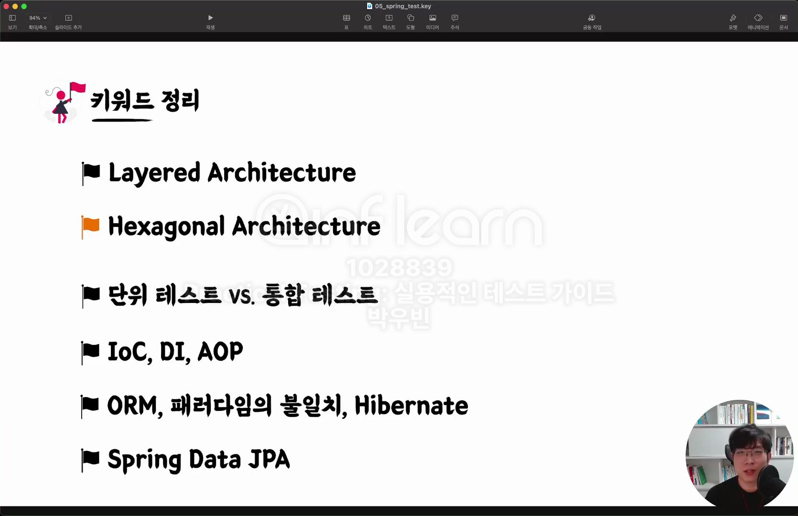
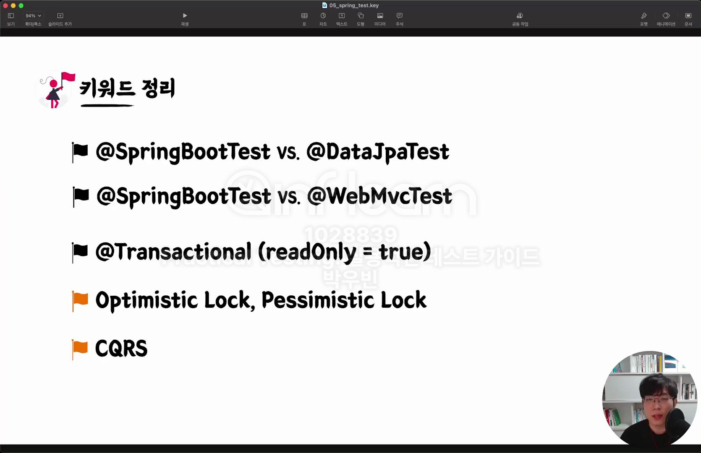
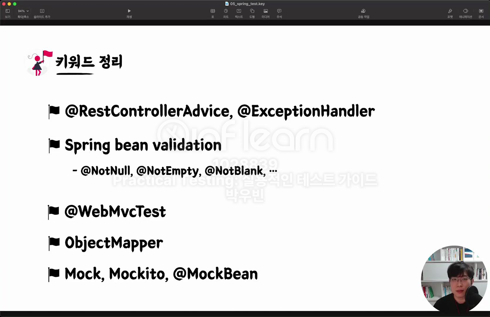

# 발자국 - Week3

## 💡 자기만의 언어로 키워드 정리하기

### 섹션 6. Spring & JPA 기반 테스트 

**Layered Architecture**
+ 레이어드 아키텍처의 단점 : 기술에 대한 강결합이 심하다는 단점이 존재 

**Hexagonal Architecture**
+ 도메인 모델은 외부의 것들을 아예 모른다. 
+ 도메인 모델 중심 (멀티 모듈 및 시스템이 커진다면..)

**단위테스트 vs. 통합테스트**
+ 단위테스트 만으로는 커버하기 어려운 영역이 존재 (여러 모듈 및 여러 객체가 협력하기 때문에)
+ 통합테스트란 
  + 여러 모듈이 협력하는 기능을 통합적으로 검증하는 테스트 
  + 단위 테스트만으로는 기능 전체의 신뢰성을 보장할 수 없다.

**IoC, DI, AOP**

**ORM, 패러다임의 불일치, Hibernate**

**Spring Data JPA**

**QueryDSL**

**@SpringBootTest vs @DataJpaTest**
+ @DataJpaTest는 @SpringBootTest보다 가볍다. 
+ @DataJpaTest보다는 @SpringBootTest를 더 선호 
+ @DataJpaTest는 @Transactional이 있어 롤백이 된다.
+ @SpringBootTest는 클렌징을 해주어야 한다.

**@SpringBootTest vs @WebMvcTest**

**@Transactional(readOnly = true)**
+ 테스트에서 사용 시, 롤백 되는 것에 유의 해야 한다. 
+ 트랜잭션 경계 설정을 해야한다.
+ 엔드포인트를 잘 설계해야 한다.

**Optimistic Lock, Pessimistic Lock**
+ 낙관적 락과 비관적 락

**CQRS**

**@RestControllerAdvice, @ExceptionHandler**
+ @RestControllerAdvice : ControllerAdvice의 기능을 하는데 JSON으로 응답을 해주는 Advice
+ 커스텀 예외를 던지고 @RestControllerAdvice에서 @ExceptionHandler에서 예외를 처리할 수 있다.

**Spring bean validation**
+ @NotNull, @NotEmpty, @NotBlank
+ 도메인 요구사항에서 나오는 validation과 책임 분리해야한다.
+ Controller 단에서는 최소한의 validation을 통한 검증이 이루어져야 한다.

**@WebMvcTest**

**ObjectMapper**

**Mock, Mockito, @MockBean**
+ Mock 프레임워크 : Mockito, @MockBean

