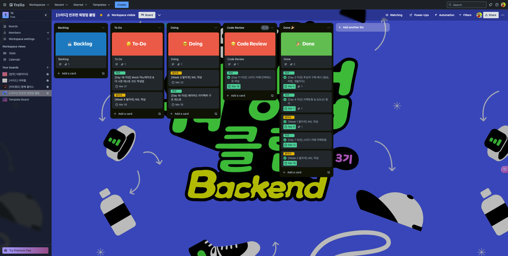
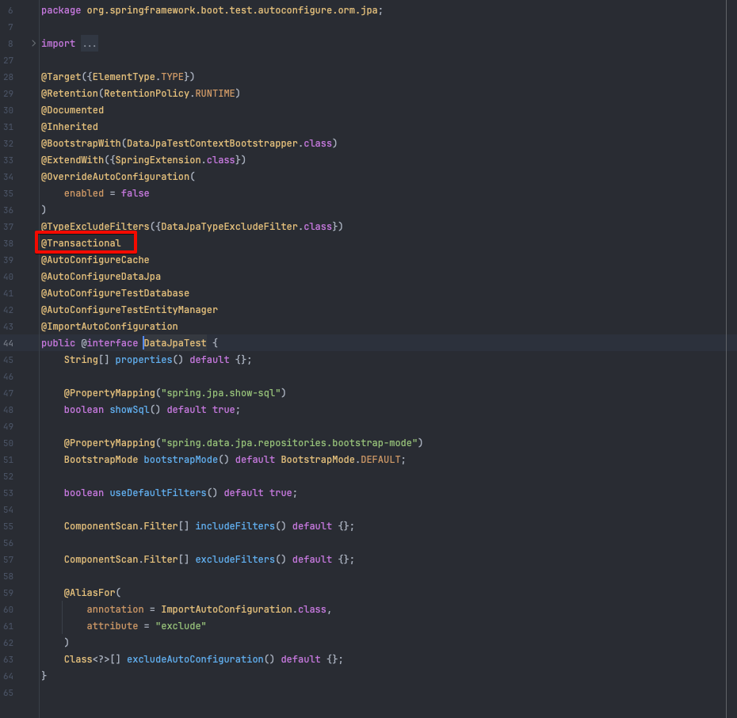
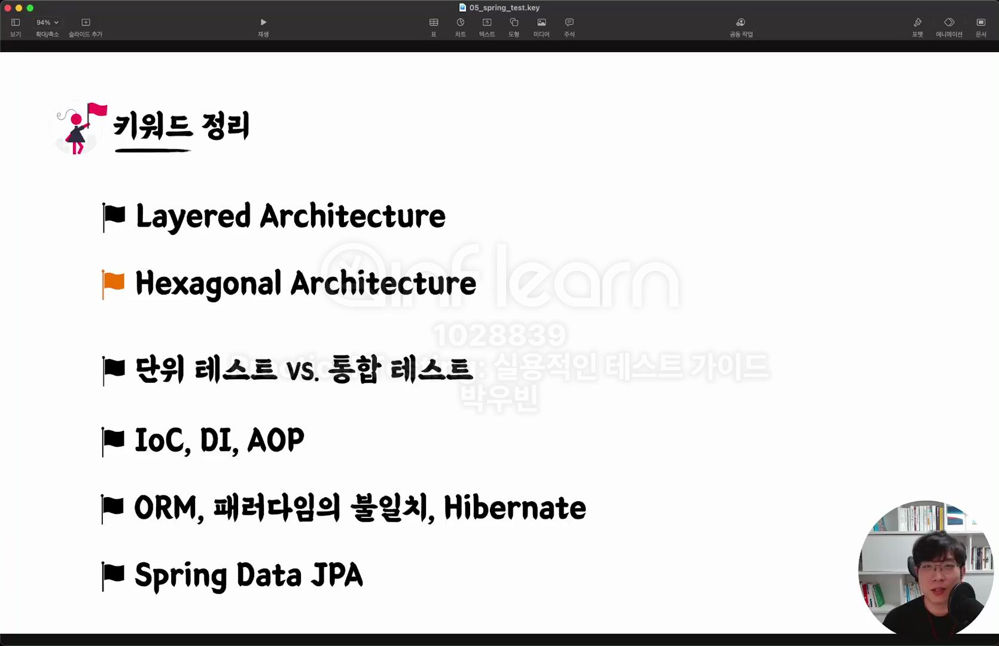
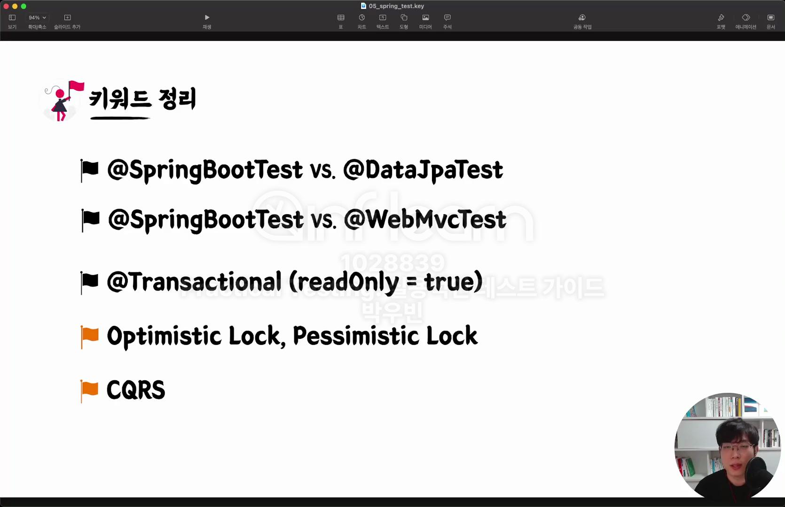
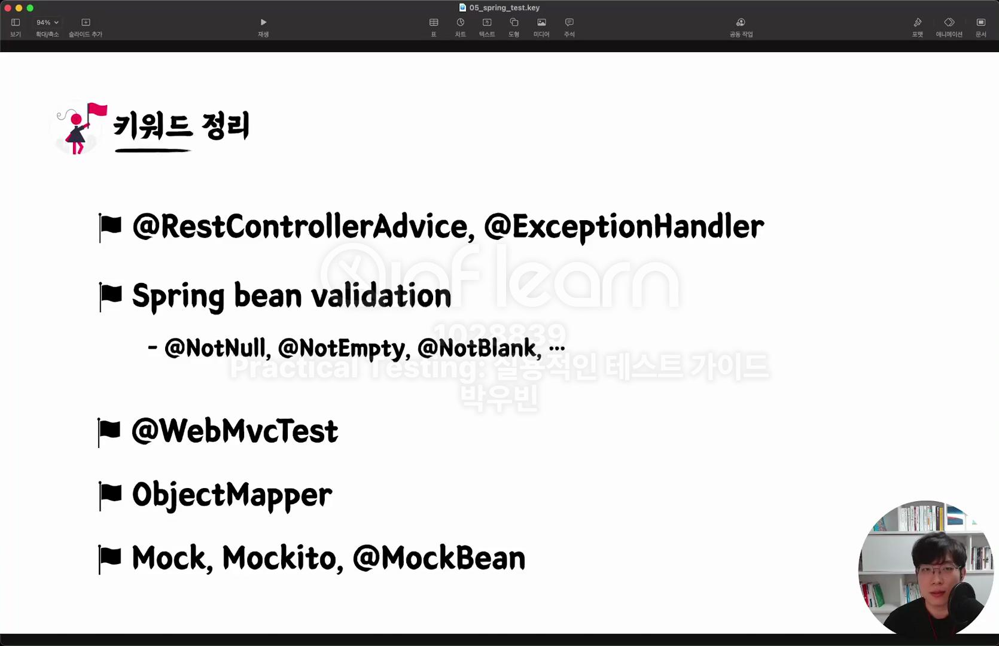
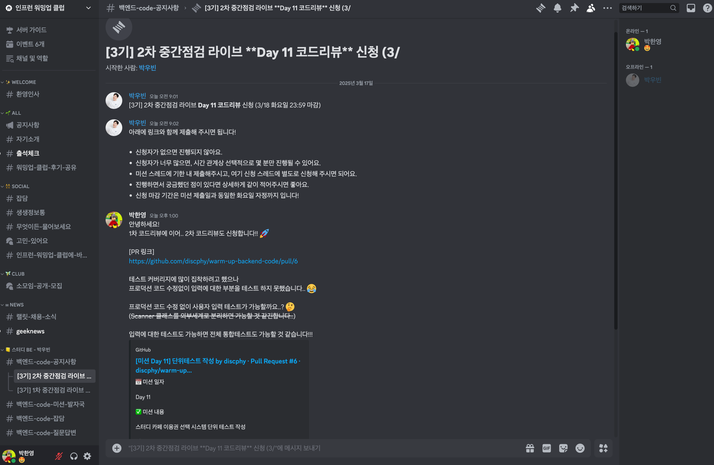

# 발자국 - Week3

## 🎼 알레그레토 : 조금 빠르게

3주차 부터는 조금 서둘러서 미션과 발자국을 미리 수행할 예정이다.   
이전 발자국에서도 언급 했지만 이번 주차 부터 항해 플러스를 참여하게 되어 최대한 진도를 빼보려고 한다. 

오늘 날짜(3월 17일) 기준으로 Day 16 미션과 발자국 3주차를 작성 중에 있다.   
그리고 금주 안에 Day 18 미션과 발자국 4주차도 작성을 완료할 생각이다. (~~가능할지는 모르겠지만 ㅎㅎ~~)

조금 서두르는 감이 없지 않아 개인적으로는 아쉽다.  
참여하고 있는 워밍업 클럽에만 온전히 집중할 수 있는 환경이였다면 개인적으로도 더 성장을 많이 했었을 것 같다는 생각이든다. 

하지만, 후회는 하지 않는다. 
다음 기수의 존재는 우빈님만 아시겠지만, 다음에 또 없을 수도 있는 기회를 놓치고 싶지 않았기 때문이다. 👍



나는 위의 이미지처럼 [Trello](https://trello.com/)의 도움을 받아 인프런 워밍업 클럽에 참여 중이다.  
미션 제출 날짜가 규칙적이지 않아, 제출 하루 전에 노티를 해주게끔 설정해서 잘 사용하고 있다. 🙃

## 💡 자기만의 언어로 키워드 정리하기

### 섹션 6. Spring & JPA 기반 테스트 

**Layered Architecture**
+ 레이어드 아키텍처의 단점 : 기술에 대한 강결합이 심하다는 단점이 존재 

**Hexagonal Architecture**
+ 도메인 모델은 외부의 것들을 아예 모른다. 
+ 도메인 모델 중심 (멀티 모듈 및 시스템이 커진다면..)

**단위테스트 vs. 통합테스트**
+ 단위테스트 만으로는 커버하기 어려운 영역이 존재 (여러 모듈 및 여러 객체가 협력하기 때문에)
+ 통합테스트란? 
  + 여러 모듈이 협력하는 기능을 통합적으로 검증하는 테스트 
  + 단위 테스트만으로는 기능 전체의 신뢰성을 보장할 수 없다.

**IoC, DI, AOP**

**ORM, 패러다임의 불일치, Hibernate**

**Spring Data JPA**

**QueryDSL**

**@SpringBootTest vs @DataJpaTest**
+ @DataJpaTest는 @SpringBootTest보다 가볍다. 
+ @DataJpaTest보다는 @SpringBootTest를 더 선호 
+ @DataJpaTest는 @Transactional이 있어 롤백이 된다.
+ @SpringBootTest는 클렌징을 해주어야 한다.



**@SpringBootTest vs @WebMvcTest**
+ @SpringBootTest는 E2E 테스트, 즉 통합테스트 시 사용하는 어노테이션이다. 
+ @WebMvcTest는 Presentation Layer에 대한 단독 테스트시 사용하는 어노테이션이다. 
  + 다른 레이어들은 mocking을 통해 동작을 제어한다.

**@Transactional(readOnly = true)**
+ 테스트에서 사용 시, 롤백 되는 것에 유의 해야 한다. 
+ 트랜잭션 경계 설정을 해야한다.
+ 엔드포인트를 잘 설계해야 한다.

**Optimistic Lock, Pessimistic Lock**
+ 낙관적 락 : 데이터 충돌이 자주 발생하지 않을 것이라 낙관적으로 가정하고, 트랜잭션을 진행하는 방식
  + 데이터를 읽을 때는 락을 걸지 않고, 데이터를 업데이트 시 버전 비교하여 충돌 여부 판단
  + 성능 저하를 최소화, 동시성을 높이는 데 유리 
+ 비관적 락 : 데이터 충돌이 자주 발생할 것이라 비관적으로 가정하고, 트랜잭션이 데이터를 사용할 때 미리 잠금을 거는 방식
  + 데이터 일관성을 유지하는 데 초점
  + 트랜잭션이 완료될 때까지 다른 트랜잭션이 데이터를 수정할 수 없음 
  + 데드락 발생 가능

**CQRS**
+ 명령 조회 책임 분리 : Command Query Responsibility Segregation
+ 읽기(조회)와 쓰기(명령)의 책임을 분리하는 소프트웨어 아키텍처 패턴
+ 장점
  + 성능 최적화 
  + 확장성 증가 
  + 데이터 모델 최적화
  + 비지니스 로직의 명확한 분리
+ 단점
  + 복잡성 증가 
  + 데이터 동기화 문제 
  + 트랜잭션 관리 어려움

**@RestControllerAdvice, @ExceptionHandler**
+ @RestControllerAdvice : ControllerAdvice의 기능을 하는데 JSON으로 응답을 해주는 Advice
+ 커스텀 예외를 던지고 @RestControllerAdvice에서 @ExceptionHandler에서 예외를 처리할 수 있다.

**Spring bean validation**
+ @NotNull, @NotEmpty, @NotBlank
+ 도메인 요구사항에서 나오는 validation과 책임 분리해야한다.
+ Controller 단에서는 최소한의 validation을 통한 검증이 이루어져야 한다.

**@WebMvcTest**

**ObjectMapper**
+ Jackson 라이브러리에서 제공하는 클래스로, Java 객체와 JSON 간의 변환을 담당하는 역할
+ 직렬화, 역직렬화를 수행

**Mock, Mockito, @MockBean**
+ Mock : 실제 객체 없이 동작을 모방하여 단위 테스트를 수행하는 가짜 객체
+ Mockito : Java에서 Mock 객체를 쉽게 생성하고 관리할 수 있는 라이브러리
+ @MockBean : Spring 컨텍스트에 Mock 객체를 등록하여 실제 빈을 대체
  + @Mock : 순수한 자바에서 Spring 컨텍스트가 필요하지 않을 때 사용 
  + @MockBean : Spring 컨텍스트에서 특정 빈을 Mocking 하고 싶을 때 사용







## 👨🏻‍💻 미션 회고

### [미션 Day 11]

**[미션 PR]**  
https://github.com/discphy/warm-up-backend-code/pull/6

**스터디 카페 이용권 선택 시스템 단위 테스트 작성**

미션 조건은 다음과 같다.

✔️각 프로젝트 모두 강의 중에 작성한 tobe 패키지 코드를 기준으로 함 (lesson 6-4 가 가장 마지막 버전)  
✔️3개 이상의 서로 다른 클래스 & 총 7개 이상의 테스트 작성 ➡️ 단, 같은 인터페이스를 구현하고 있는 구현체들은 1개 클래스로 간주한다.   
✔️무엇을 테스트하고자 했는지를 잘 나타낸 @DisplayName 작성하기  
✔️BDD(given/when/then) 스타일 따르기 (주석으로 표기)

가장 작은 단위의 메서들 부터 단위 테스트 코드를 작성하였고,   
테스트 커버리지를 높이기 위해, 주요 로직과 관련된 메서드들은 전부 단위테스트를 작성하고자 했다. 

단위테스트를 작성하면서 강의에서도 강조한 내용 중에 하나인 @DisplayName을 잘 작성하기 위해 고민을 많이 했던 것 같다.

+ '**권**'이라는 Pass의 의미를 '**패스**'로 통일하여 일관성있게 작성하였다. 
+ 읽는 사람으로 하여금 뇌 메모리를 적게 쓰게 하기 위해 `@DisplayName`도 최대한 **추상화**해서 작성하려고 노력했다. 
+ 테스트의 **현상**을 중점적으로 작성하지 않으려고 하였다.

하지만, 사용자 입력을 받는 클래스인 InputHandler의 단위테스트를 작성하는 과정에서 어려움이 있었다.  
InputHandler 내부에서 static으로 Scanner를 인스턴스화 해서 mocking도 하기 어려웠다.

```java
public class InputHandler {
    
    private static final Scanner SCANNER = new Scanner(System.in);

}
```

프로덕션 코드를 수정하지 않는다는 요구사항에서는 테스트가 불가능하였다.
만약 프로덕션 코드를 수정한다면 가능할 것 같았다. 

+ ☝️ Scanner를 외부세계로 분리하면 테스트가 가능할 것 같다. 
+ ✌️ InputHandler 상위의 인터페이스를 생성 후, 테스트 전용 support 성격의 구현체를 만들어서 테스트가 가능할 것 같다.

미션 제출 후, 차후에 프로덕션 코드를 수정해서 테스트를 작성 해볼 예정이다.

## 🏃 돌아보며..

Day 11 미션은 제출이 끝이 아니라, 중간점검 라이브 때 이은 마지막 라이브 시간에서의 코드리뷰 단계가 남아있다.  
중간 점검 때 세심한 코드 리뷰를 받고 수정하면서 성장을 경험 했기에 이번에도 신청을 하지 않을 수 없었다. 

다른 러너 분들도 꼭 받아봤으면 한다. 😊  
아직까지 혼자 신청해서 뻘줌해서가 아니라 진짜 좋은 경험이다... 🤣 



코드 리뷰 대상자로 뽑히길 기대하며.. 마지막 4주차도 화이팅 💪

