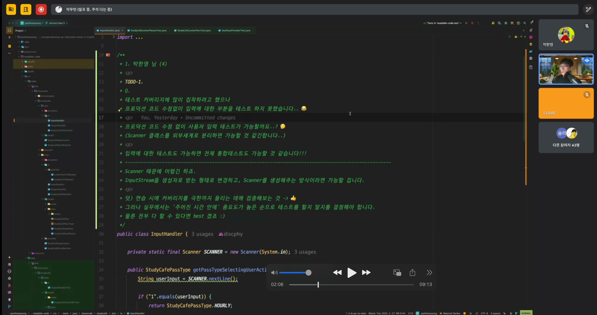
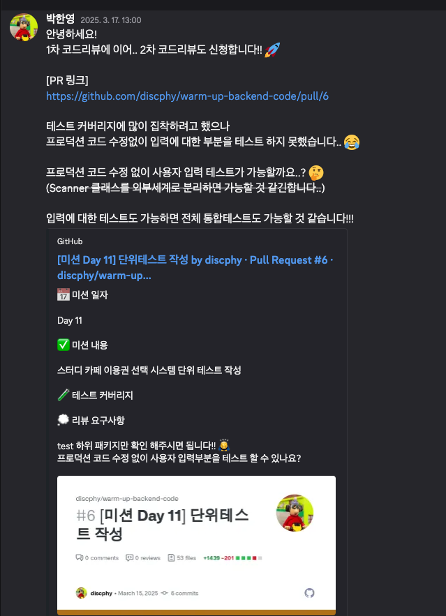

# 발자국 - Week4

## ⏰ 벌써 1분기 끝...

약 한 달간의 인프런 워밍업 클럽 백엔드 코드 3기 여정이 끝났다.   
올해는 유난히 바빠서 그런지, 시간이 유독 더 빨리 가는 것 같다.
벌써 1분기가 끝났다는 게… 믿기지 않는다. 😂

우빈님께서는 온라인 세션 때 시간이 빨리간다는 농담을 해주시곤 한다.   
우빈님의 지인이 ‘시간이 너무 빨리 가서 곧 크리스마스 트리를 설치해야겠다’고 하셨던 말씀이 기억에 남는다. ㅋㅋ 🤣
(~~맞나? 이게? 자세히 기억은 아나지만..~~)

아무튼! 마지막 주차 최종 점검 온라인 라이브 세션을 마지막으로 스터디를 완주하였다. 👏  
기대하고 기다리던 코드 리뷰를 다시 받게 되었다!

## ✨ 두번째 우빈님의 세심한 코드 리뷰

이번 코드 리뷰는 작성한 단위 테스트 코드에 대한 리뷰를 받았다.

중간점검 때 받았던 리팩토링 코드 리뷰보다는 과제가 다소 정형화(?) 되어 있어서 공통 피드백이 많긴 했다.    
**다시 한번 우빈님의 세심한 리뷰에 놀랐다. 😮**

**🔗 Github PR 링크**  
[단위테스트 작성 PR](https://github.com/discphy/warm-up-backend-code/pull/6)



### 1️⃣ 사용자 입력에 대한 테스트 방법

이건 내가 PR에 궁금했던 질문 중 하나였다. 🧐

프로덕션 코드를 수정하면 안된다는 제약을 걸고, 테스트 코드를 작성하려고 했기 때문에..!    
사용자 입력을 받는 `Scanner`에 대한 테스트는 어떻게 하는지 궁금했다.



**🧪️ 테스트 하려고 했던 코드**

```java
public class InputHandler {

    private static final Scanner SCANNER = new Scanner(System.in);

    ...(중략)...
}
```

**✏️ 우빈님 리뷰**

```
Q. 프로덕션 코드 수정 없이 사용자 입력 테스트가 가능할까요..? 🤔
(Scanner 클래스를 외부세계로 분리하면 가능할 것 같긴합니다..)

입력에 대한 테스트도 가능하면 전체 통합테스트도 가능할 것 같습니다!!!

A. Scanner 때문에 어렵긴 하죠.
InputStream을 생성자로 받는 형태로 변경하고, Scanner를 생성해주는 방식이라면 가능할 겁니다. 
```

**🤔 돌아보기**

역시, 프로덕션 코드를 수정하지 않으면 테스트가 어렵다는 말씀을 주셨다.   
우빈님 리뷰를 반영하여 프로덕션 코드 부분을 `InputStream`을 생성자로 받는 형태로 리팩토링해봐야겠다.

### 2️⃣ 테스트 커버리지에 대한 우빈님의 관점

리뷰 신청 시에, "테스트 커버리지의 집착"에 대해 언급을 했었는데..  
세심한 우빈님께서 포인트를 짚어주셨다...!! 🥹

**✏️ 우빈님 리뷰**

```
A. 연습 시에 커버리지를 극한까지 올리는 데에 집중해보는 것 -> 👍
그러나 실무에서는 '주어진 시간 안에' 중요도가 높은 순으로 테스트를 할지 말지를 결정해야 합니다. 
물론 전부 다 할 수 있으면 best 겠죠 :)
```

**🤔 돌아보기**

**실무에서의 테스트 커버리지**에 대한 관점을 말씀주셨다...  
테스트 커버리지를 높이는 것도 중요하지만, 비즈니스 우선이라는 점을 반드시 인지하자.

테스트 코드 작성 시, 중요도를 따져보는 연습을 해봐야겠다.  
그리고 실무에서의 커버리지에 대한 집착은 지양하도록 하자.  
대신, 사이드 프로젝트에서는 커버리지를 극한까지 끌어올리는 연습에 집중해보는 것도 좋겠다.

### 3️⃣ 한 눈에 들어오게끔 'given' 절 작성하기

다음 코드는 `given` 절에 선언한 컬렉션 변수가 너무 길어서 `private` 메서드로 분리한 형태이다.

```java

@DisplayName("좌석 패스로 기간과 타입이 동일한 사물함 패스를 찾는다.")
@Test
void findLockerPassBy() {
    // given
    List<StudyCafeLockerPass> list = lockerPassList();
    StudyCafeLockerPasses lockerPasses = StudyCafeLockerPasses.of(list);
    
    ...(중략)...
}

private List<StudyCafeLockerPass> lockerPassList() {
    return List.of(
        StudyCafeLockerPass.of(StudyCafePassType.FIXED, 4, 11000),
        StudyCafeLockerPass.of(StudyCafePassType.WEEKLY, 4, 17000),
        StudyCafeLockerPass.of(StudyCafePassType.FIXED, 12, 11000),
        StudyCafeLockerPass.of(StudyCafePassType.FIXED, 4, 18000),
        StudyCafeLockerPass.of(StudyCafePassType.HOURLY, 8, 11000),
        StudyCafeLockerPass.of(StudyCafePassType.FIXED, 10, 11000)
    );
}
```

**✏️ 우빈님 리뷰**

```
A. lockerPassList()가 private 메서드라 list가 무엇인지 한 눈에 잘 들어오지 않는다. 
어차피 정해진 리스트라면, 상단에 상수로 관리하면 어떨까?

네이밍도 list -> allLockerPasses로 "모든" 사물함 패스 라는 의미를 주면 
모든 사물함 패스가 존재할 때, 내 좌석권에 맞는 사물함 패스를 찾는다는 내용으로 변수명을 변경하면 좀 더 이해하기 쉬울 것 같다.
```

**🤔 돌아보기**

당시에 완전 뜨끔했던 리뷰였다.. 💯  
내가 작성한 코드를 보니 메서드도 메서드인데 왜 변수명을 저렇게 작성했을까?라는 의문이 든다. 🤦‍♂️

테스트 코드의 given 절은 중복 제거보다도 '한눈에 들어오는 것'이 더 중요하다고 하셨다.     
읽는 사람의 '뇌 메모리'를 덜 쓰게끔 given 절을 설계하는 연습이 필요해 보인다.

리뷰를 바로 반영하여 아래의 코드로 리팩토링 했다. ♻️

```java
private static final List<StudyCafeLockerPass> ALL_LOCKER_PASSES = List.of( // 👍 상수로 추출 및 네이밍 변경
    StudyCafeLockerPass.of(StudyCafePassType.FIXED, 4, 11000),
    StudyCafeLockerPass.of(StudyCafePassType.WEEKLY, 4, 17000),
    StudyCafeLockerPass.of(StudyCafePassType.FIXED, 12, 11000),
    StudyCafeLockerPass.of(StudyCafePassType.FIXED, 4, 18000),
    StudyCafeLockerPass.of(StudyCafePassType.HOURLY, 8, 11000),
    StudyCafeLockerPass.of(StudyCafePassType.FIXED, 10, 11000)
);

@DisplayName("좌석 패스로 기간과 타입이 동일한 사물함 패스를 찾는다.")
@Test
void findLockerPassBy() {
    // given
    StudyCafeLockerPasses lockerPasses = StudyCafeLockerPasses.of(ALL_LOCKER_PASSES);
```

### 4️⃣ 전역적인 기능을 Stub시, 주의 하기

다음은, 엑셀에 있는 패스권 목록을 가져오는 부분을 '**mocking**'한 부분이다.

```java

@DisplayName("파일을 읽어서 좌석 패스를 가져온다.")
@Test
void getSeatPasses() {
    try (MockedStatic<Files> mockedFiles = mockStatic(Files.class)) {
        // given
        mockedFiles.when(() -> Files.readAllLines(any()))
            .thenReturn(List.of(
                "WEEKLY,2,4000,0.0",
                "WEEKLY,12,120000,0.3",
                "HOURLY,4,6500,0.1"
            ));
    }
}
```

**✏️ 우빈님 리뷰**

```
A. mockStatic으로 Files mocking 👍
다만, Files.readAllLines()를 stubbing하는 등의 전역적인 기능을 조작하는 것은 멀티스레드로 병렬 테스트를 수행할 때 
문제가 될 수 있으므로 주의 필요
```

**🤔 돌아보기**

`mockStatic`을 이용해서 작성한 코드가 병렬 테스트 수행 시, 테스트 코드가 깨질 수 있다는 사실을 처음 알게 되었다.  
간단한 테스트라면 괜찮을 수 있지만, 실무에서는 반드시 **지양**해야겠다.

---

이번 코드 리뷰는 **실무에서의 주의할 점**에 대해 많이 언급해주셨다. ⭐️

+ 테스트 커버리지의 양면성 및 실무에서의 지양
+ `mockStatic`의 병렬 테스트 시, 사이드 이펙트 발생

단순히, 테스트 코드를 많이 작성하는 것보다 중요도 높은 혹은 의미있는 테스트 코드를 작성하려고 노력해야 겠다. ✨  
"이 글이 우빈님께 닿지는 않겠지만..😅 **우빈님! 감사드립니다.🙇‍♂️**"

## 💡 자기만의 언어로 키워드 정리하기

### 섹션 7. Mock을 마주하는 자세

**Test Double, Stubbing**

1️⃣ Dummy

+ 아무것도 하지 않는 깡통 객체
+ 단순히 인자를 채우기 위해 사용되며, 호출되지 않음

```java
class DummyUser implements User {

    @Override
    public String getName() {
        return null; // 의미 없는 값
    }
}
```

2️⃣ Fake

+ 단순한 형태로 동일한 기능은 수행하나, 프로덕션에서 쓰기에는 부족한 객체 (ex. FakeRepository)

```java
class FakeUserRepository implements UserRepository {

    private Map<Long, User> users = new HashMap<>();

    @Override
    public User findById(Long id) {
        return users.get(id);
    }

    public void save(User user) {
        users.put(user.getId(), user);
    }
}
```

3️⃣ Stub

+ 테스트에서 요청한 것에 대해 미리 준비한 결과르 제공하는 객체, 그 외에는 응답하지 않는다.
+ 특정한 고정된 값을 반환하는 객체
+ 테스트에서 정해진 응답이 필요할 때 사용

```java
class StubUserRepository implements UserRepository {
    @Override
    public User findById(Long id) {
        return new User(id, "stub_user");
    }
}
```

4️⃣ Spy

+ Stub이면서 호출된 내용을 기록하여 보여줄 수 있는 객체, 일부는 실제 객체처럼 동작시키고 일부만 Stubbing 할 수 있다.
+ 메서드 호출 여부, 호출 횟수 등을 검증하는 데 사용

```java
class SpyEmailSender implements EmailSender {
    private int sendCount = 0;

    @Override
    public void sendEmail(String message) {
        sendCount++;
    }

    public int getSendCount() {
        return sendCount;
    }
}
```

5️⃣ Mock

+ 행위에 대한 기대를 명세하고, 그에 따라 동작하도록 만들어진 객체

```java

@Test
void testMockExample() {
    EmailSender emailSender = mock(EmailSender.class);

    emailSender.sendEmail("test@example.com");

    verify(emailSender).sendEmail("test@example.com"); // 호출 검증
}
```

**Stub과 Mock차이**

+ Stub는 상태 검증, Mock은 행위 검증
+ Stub는 메서드가 특정 값을 반환하도록 설정하기 때문에, 반환한 값에 대한 검증을 한다.
+ Mock은 특정 메서드가 정확히 호출되었는지 검증하는 역할을 한다.

**Stubbing이란?**

+ Mock의 행위를 지정하는 것, 즉 Mock 객체의 행동을 조작하는 것
+ Mockito의 when, thenReturn 메서드를 활용하여 Stubbing 할 수 있다.

**@Mock, @MockBean, @Spy, @SpyBean, @InjectMocks**

+ Spy는 이해할 때 기능 중에 스파이가 있다(?)라고 기억하면 편하다 ㅎㅎ 😂

**BDDMockito**

+ BDD 스타일의 Mockito 버전으로 given(), willReturn(), then() 등을 사용하여 직관적인 테스트를 작성할 수 있다.

**Classicist vs. Mockist**

+ Mockist : 모든 테스트를 mocking 위주로 하자라는 입장
+ Classicist : 진짜 객체간의 협업을 통한 보장 (mocking을 무조건 하지말라는 건 아님)
    + 각각 객체에 대한 테스트가 잘 되도 협업 시에는 모르는 문제가 나올 수 있다. (A + B = AB? BA? C?)
    + 외부 시스템 로직이 있을 때는 mocking 처리하는 것이 좋다.


### 섹션 8. 더 나은 테스트를 작성하기 위한 구체적조언

**테스트 하나 당 목적은 하나!**

+ 테스트 코드 내부의 분기문이나 반복문처럼 고민을 요구하는 코드는 로직이 여러가지이기 때문에, 테스트 케이스가 여러개이다.
+ 테스트 케이스 별로 각각의 테스트 코드를 작성하자.

**완벽한 제어**

+ given 데이터를 만들 때 LocalDate.now(), LocalDateTime.now() 사용하지 않는 게 좋다.
+ 테스트 코드 실행 시마다 의도하는 바가 달라지기 때문에 영향을 끼친다.
+ 제어할 수 없는 값을 제어 가능하게 변경하자.

**테스트 환경의 독립성, 테스트 간 독립성**

+ 공유변수, 연관관계가 있는 테스트코드는 지양하자.

**Test Fixture**

+ given절에 최대한 명시한다.
+ 메서드를 추출할 때 필요한 파라미터만 명시한다.
+ 별도의 data.sql 데이터를 추출하지 않는다.
+ 단위테스트 내에서 모두 표현한다.

**deleteAll(), deleteAllInBatch()**

+ @Transactional은 사이드 이펙트를 고려해서 클렌징해야한다.
+ 결국은 테스트도 비용이다... 아무리 h2 인메모리 DB를 사용한다지만 deleteAll()처럼 다수의 쿼리가 발생하면 테스트 비용이 증가한다.
+ deleteAllInBatch() 벌크성으로 데이터를 클렌징하다.
+ @Transactional와 deleteAllInBatch() 혼용해서 사용하는 것이 좋다.

**@ParameterizedTest, @DynamicTest**

+ @ParameterizedTest
    + 동일한 테스트를 다른 입력값으로 테스트 할 때 사용
    + @ValueSource, @CsvSource, @MethodSource 등 다양한 소스로부터 테스트가 가능하다.

```java

@DisplayName("상품 타입이 재고 관련 타입인지를 체크한다.")
@ParameterizedTest
@CsvSource({"HANDMADE, false", "BOTTLE, true", "BAKERY, true"})
void containsStockType3(ProductType productType, boolean expected) {
    // when
    boolean result = ProductType.containsStockType(productType);

    // then
    assertThat(result).isEqualTo(expected);
}

private static Stream<Arguments> provideProductTypesForCheckingStockType() {
    return Stream.of(
        Arguments.of(HANDMADE, false),
        Arguments.of(BOTTLE, true),
        Arguments.of(BAKERY, true)
    );
}

@DisplayName("상품 타입이 재고 관련 타입인지를 체크한다.")
@ParameterizedTest
@MethodSource("provideProductTypesForCheckingStockType")
void containsStockType4(ProductType productType, boolean expected) {
    // when
    boolean result = ProductType.containsStockType(productType);

    // then
    assertThat(result).isEqualTo(expected);
}
```

+ @DynamicTest
    + 테스트를 실행할 때 동적으로 생성하는 방식
    + @TestFactory를 사용한다.

```java

@DisplayName("재고 차감 시나리오")
@TestFactory
Collection<DynamicTest> stockDeductionDynamicTest() {
    // given
    Stock stock = Stock.create("001", 1);

    return List.of(
        DynamicTest.dynamicTest("재고를 주어진 개수만큼 차감할 수 있다.", () -> {
            // given
            int quantity = 1;

            // when
            stock.deductQuantity(quantity);

            // then
            assertThat(stock.getQuantity()).isZero();
        }),
        DynamicTest.dynamicTest("재고보다 많은 수의 수량으로 차감 시도하는 경우 예외가 발생한다.", () -> {
            // given
            int quantity = 1;

            // when & then
            assertThatThrownBy(() -> stock.deductQuantity(quantity))
                .isInstanceOf(IllegalArgumentException.class)
                .hasMessage("차감할 재고 수량이 없습니다.");
        })
    );
}
```

**수행 환경 통합하기**

+ 더 자주, 더 빠르게 수행하는 환경을 구축하자.
+ 공통 환경을 추출해서 통합 클래스를 만들어 서버 뜨는 횟수를 줄인다.

**private method test**

+ 수행할 필요가 없다.
+ 욕망이 강하다면 객체 분리의 신호이다.

**테스트에서만 필요한 코드**

+ 프로덕션 코드에 만들어도 되지만 최대한 보수적으로 생성


### 섹션 9. Appendix지만 중요한 것들

**학습 테스트**

+ 잘 모르는 기능, 라이브러리, 프레임워크를 학습하기 위한 테스트 코드
+ 여러 테스트 케이스를 스스로 정의하고 검증하는 과정을 통해 구체적인 동작과 기능을 학습

**Spring Rest Docs**

+ 테스트 코드를 통한 API 문서 자동화 도구
+ API 명세를 문서로 만들고 제공함으로써 협업을 원활하게 한다.

## 👨🏻‍💻 미션 회고

### [미션 Day 16]

**[미션 PR]**

https://github.com/discphy/warm-up-backend-code/pull/8

**1️⃣ 레이어드 아키텍처 특징 및 테스트 작성법**

+ 레이어드 아키텍처의 특징을 개념 위주로 정리하고, 레이어별 테스트 작성법은 예제 코드를 활용해 정리하였다.
+ 특히, 레이어별 테스트를 작성하는 과정에서 `Test Fixture`와 데이터 클렌징 개념을 함께 학습하며, 이를 예제 코드에 적용하였다.
+ 차후에 실무 및 사이드 프로젝트에서 레이어드 아키텍처를 직접 적용해 보며 응용해볼 계획이다.

### [미션 Day 18]

**[미션 PR]**

https://github.com/discphy/warm-up-backend-code/pull/9

**2️⃣ Mock 어노테이션 종류 및 차이점 & BDD 패턴 적용**

**📌 Mock 어노테이션 종류 및 차이점**

+ Mockito의 주요 어노테이션(@Mock, @Spy, @InjectMocks, @MockBean, @SpyBean)의 차이를 자기만의 언어로 정리하였다.
+ 순수한 Mock 기반 단위 테스트와 Spring Context 기반 통합테스트에서 각각 어떤 어노테이션을 사용해야 하는지 이해하였다.

**📌 BDD 패턴 적용**

+ 댓글의 주요 로직을 테스트하는 클래스 CommentTest을 작성하였다.
+ 각 테스트 케이스에서 댓글 도메인을 테스트 하기 위한 사용자와 게시글을 생성하는 코드를 @BeforeEach 절에 배치하였다.

## 🏃 돌아보며..

짧다면 짧고, 길다면 긴 인프런 스터디 여정을 드디어 완주했다. 👏👏👏  
(잠시나마, 한숨을 돌릴 수 있게 되었다. 😮‍💨)

한 줄 평을 해보자면, **"정말 너무 좋기만 했다."**

생각보단 업무와 병행하며 쉽지 않은 일정이긴 하지만!?

내가 듣고 싶었던 강의의 강의료만 내고..   
강사님과의 네트워킹을 하며.. 스터디에 참여하고..  
단기간에 성장까지 경험할 수 있다면, **"참여하지 않을 이유가 있을까?"** 🤔

다음 기수 때도 기회가 된다면 지원을 해 볼 생각이다!!   
그리고! 주변에서 참여를 고민한다면!? 바로 적극 지지 해줄 것 같다.

인프런 워밍업 클럽 스터디 만만세!! 🙌  
강사진과 운영진분들, 진심으로 고생 많으셨습니다. 감사합니다! 🙇‍♂️

[출처]

+ 인프런 워밍업 클럽 : https://www.inflearn.com/course/offline/warmup-club-3-be-code
+ 강의 : https://www.inflearn.com/course/readable-code-%EC%9D%BD%EA%B8%B0%EC%A2%8B%EC%9D%80%EC%BD%94%EB%93%9C-%EC%9E%91%EC%84%B1%EC%82%AC%EA%B3%A0%EB%B2%95/dashboard