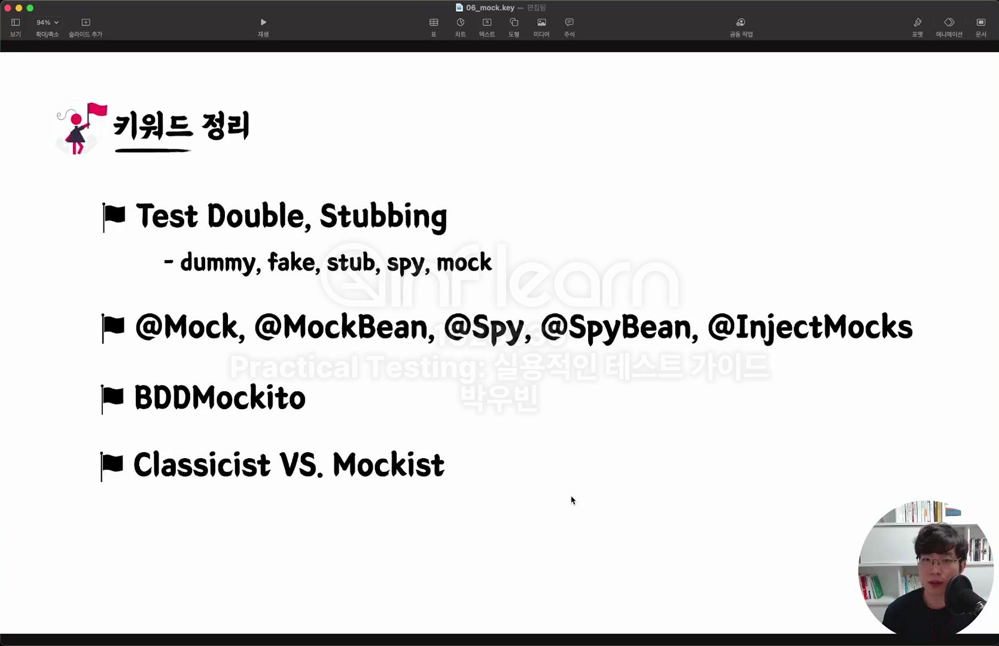
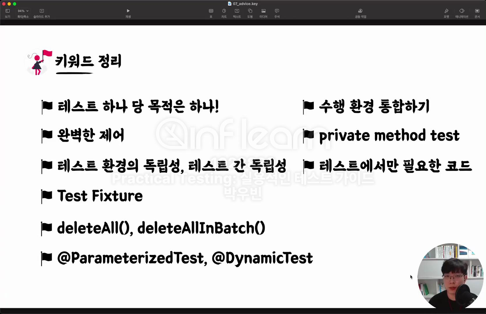

# 발자국 - Week4

## 💡 자기만의 언어로 키워드 정리하기

### 섹션 7. Mock을 마주하는 자세

**Test Double, Stubbing**

1️⃣ Dummy

+ 아무것도 하지 않는 깡통 객체
+ 단순히 인자를 채우기 위해 사용되며, 호출되지 않음

```java
class DummyUser implements User {

    @Override
    public String getName() {
        return null; // 의미 없는 값
    }
}
```

2️⃣ Fake

+ 단순한 형태로 동일한 기능은 수행하나, 프로덕션에서 쓰기에는 부족한 객체 (ex. FakeRepository)

```java
class FakeUserRepository implements UserRepository {

    private Map<Long, User> users = new HashMap<>();

    @Override
    public User findById(Long id) {
        return users.get(id);
    }

    public void save(User user) {
        users.put(user.getId(), user);
    }
}
```

3️⃣ Stub

+ 테스트에서 요청한 것에 대해 미리 준비한 결과르 제공하는 객체, 그 외에는 응답하지 않는다.
+ 특정한 고정된 값을 반환하는 객체
+ 테스트에서 정해진 응답이 필요할 때 사용

```java
class StubUserRepository implements UserRepository {
    @Override
    public User findById(Long id) {
        return new User(id, "stub_user");
    }
}
```

4️⃣ Spy

+ Stub이면서 호출된 내용을 기록하여 보여줄 수 있는 객체, 일부는 실제 객체처럼 동작시키고 일부만 Stubbing 할 수 있다.
+ 메서드 호출 여부, 호출 횟수 등을 검증하는 데 사용

```java
class SpyEmailSender implements EmailSender {
    private int sendCount = 0;

    @Override
    public void sendEmail(String message) {
        sendCount++;
    }

    public int getSendCount() {
        return sendCount;
    }
}
```

5️⃣ Mock

+ 행위에 대한 기대를 명세하고, 그에 따라 동작하도록 만들어진 객체

```java

@Test
void testMockExample() {
    EmailSender emailSender = mock(EmailSender.class);

    emailSender.sendEmail("test@example.com");

    verify(emailSender).sendEmail("test@example.com"); // 호출 검증
}
```

**Stub과 Mock차이**

+ Stub는 상태 검증, Mock은 행위 검증
+ Stub는 메서드가 특정 값을 반환하도록 설정하기 때문에, 반환한 값에 대한 검증을 한다.
+ Mock은 특정 메서드가 정확히 호출되었는지 검증하는 역할을 한다.

**Stubbing이란?**

+ Mock의 행위를 지정하는 것, 즉 Mock 객체의 행동을 조작하는 것
+ Mockito의 when, thenReturn 메서드를 활용하여 Stubbing 할 수 있다.

**@Mock, @MockBean, @Spy, @SpyBean, @InjectMocks**

+ Spy는 이해할 때 기능 중에 스파이가 있다(?)라고 기억하면 편하다 ㅎㅎ 😂

**BDDMockito**

+ BDD 스타일의 Mockito 버전으로 given(), willReturn(), then() 등을 사용하여 직관적인 테스트를 작성할 수 있다.

**Classicist vs. Mockist**

+ Mockist : 모든 테스트를 mocking 위주로 하자라는 입장
+ Classicist : 진짜 객체간의 협업을 통한 보장 (mocking을 무조건 하지말라는 건 아님)
    + 각각 객체에 대한 테스트가 잘 되도 협업 시에는 모르는 문제가 나올 수 있다. (A + B = AB? BA? C?)
    + 외부 시스템 로직이 있을 때는 mocking 처리하는 것이 좋다.



### 섹션 8. 더 나은 테스트를 작성하기 위한 구체적조언

**테스트 하나 당 목적은 하나!**

+ 테스트 코드 내부의 분기문이나 반복문처럼 고민을 요구하는 코드는 로직이 여러가지이기 때문에, 테스트 케이스가 여러개이다.
+ 테스트 케이스 별로 각각의 테스트 코드를 작성하자.

**완벽한 제어**

+ given 데이터를 만들 때 LocalDate.now(), LocalDateTime.now() 사용하지 않는 게 좋다.
+ 테스트 코드 실행 시마다 의도하는 바가 달라지기 때문에 영향을 끼친다.
+ 제어할 수 없는 값을 제어 가능하게 변경하자.

**테스트 환경의 독립성, 테스트 간 독립성**

+ 공유변수, 연관관계가 있는 테스트코드는 지양하자.

**Test Fixture**

+ given절에 최대한 명시한다.
+ 메서드를 추출할 때 필요한 파라미터만 명시한다.
+ 별도의 data.sql 데이터를 추출하지 않는다.
+ 단위테스트 내에서 모두 표현한다.

**deleteAll(), deleteAllInBatch()**

+ @Transactional은 사이드 이펙트를 고려해서 클렌징해야한다.
+ 결국은 테스트도 비용이다... 아무리 h2 인메모리 DB를 사용한다지만 deleteAll()처럼 다수의 쿼리가 발생하면 테스트 비용이 증가한다.
+ deleteAllInBatch() 벌크성으로 데이터를 클렌징하다.
+ @Transactional와 deleteAllInBatch() 혼용해서 사용하는 것이 좋다.

**@ParameterizedTest, @DynamicTest**

+ @ParameterizedTest
    + 동일한 테스트를 다른 입력값으로 테스트 할 때 사용
    + @ValueSource, @CsvSource, @MethodSource 등 다양한 소스로부터 테스트가 가능하다.

```java

@DisplayName("상품 타입이 재고 관련 타입인지를 체크한다.")
@ParameterizedTest
@CsvSource({"HANDMADE, false", "BOTTLE, true", "BAKERY, true"})
void containsStockType3(ProductType productType, boolean expected) {
    // when
    boolean result = ProductType.containsStockType(productType);

    // then
    assertThat(result).isEqualTo(expected);
}

private static Stream<Arguments> provideProductTypesForCheckingStockType() {
    return Stream.of(
        Arguments.of(HANDMADE, false),
        Arguments.of(BOTTLE, true),
        Arguments.of(BAKERY, true)
    );
}

@DisplayName("상품 타입이 재고 관련 타입인지를 체크한다.")
@ParameterizedTest
@MethodSource("provideProductTypesForCheckingStockType")
void containsStockType4(ProductType productType, boolean expected) {
    // when
    boolean result = ProductType.containsStockType(productType);

    // then
    assertThat(result).isEqualTo(expected);
}
```

+ @DynamicTest
    + 테스트를 실행할 때 동적으로 생성하는 방식
    + @TestFactory를 사용한다.

```java

@DisplayName("재고 차감 시나리오")
@TestFactory
Collection<DynamicTest> stockDeductionDynamicTest() {
    // given
    Stock stock = Stock.create("001", 1);

    return List.of(
        DynamicTest.dynamicTest("재고를 주어진 개수만큼 차감할 수 있다.", () -> {
            // given
            int quantity = 1;

            // when
            stock.deductQuantity(quantity);

            // then
            assertThat(stock.getQuantity()).isZero();
        }),
        DynamicTest.dynamicTest("재고보다 많은 수의 수량으로 차감 시도하는 경우 예외가 발생한다.", () -> {
            // given
            int quantity = 1;

            // when & then
            assertThatThrownBy(() -> stock.deductQuantity(quantity))
                .isInstanceOf(IllegalArgumentException.class)
                .hasMessage("차감할 재고 수량이 없습니다.");
        })
    );
}
```

**수행 환경 통합하기**

+ 더 자주, 더 빠르게 수행하는 환경을 구축하자.
+ 공통 환경을 추출해서 통합 클래스를 만들어 서버 뜨는 횟수를 줄인다.

**private method test**

+ 수행할 필요가 없다.
+ 욕망이 강하다면 객체 분리의 신호이다.

**테스트에서만 필요한 코드**

+ 프로덕션 코드에 만들어도 되지만 최대한 보수적으로 생성



### 섹션 9. Appendix지만 중요한 것들

**학습 테스트**

+ 잘 모르는 기능, 라이브러리, 프레임워크를 학습하기 위한 테스트 코드
+ 여러 테스트 케이스를 스스로 정의하고 검증하는 과정을 통해 구체적인 동작과 기능을 학습

**Spring Rest Docs**

+ 테스트 코드를 통한 API 문서 자동화 도구
+ API 명세를 문서로 만들고 제공함으로써 협업을 원활하게 한다.

