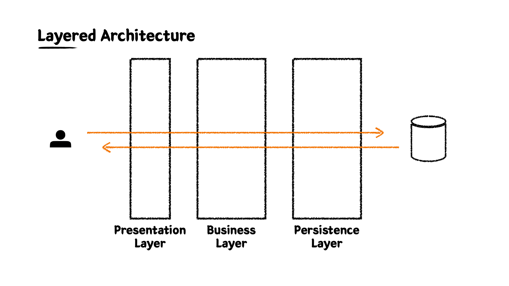
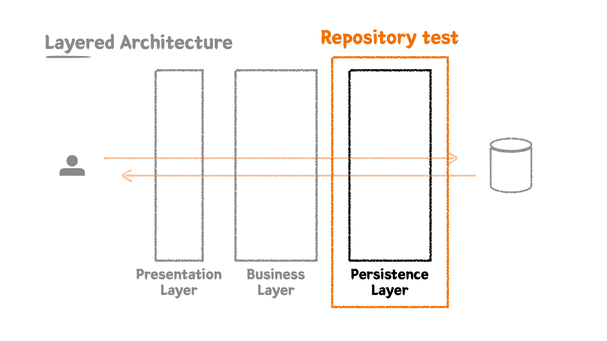
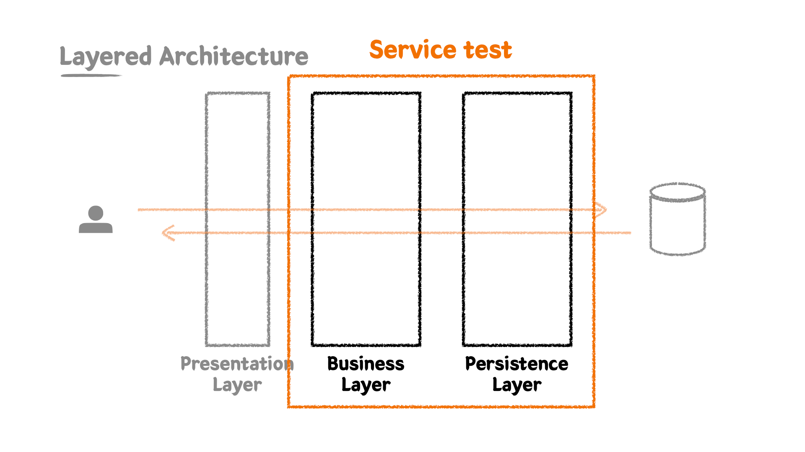
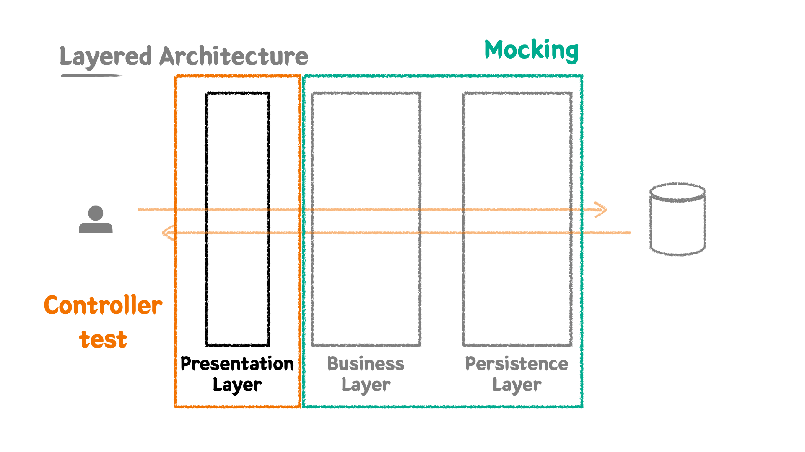

# 미션 - Day16

## 레이어드 아키텍처 특징 및 테스트 작성법 - 자기만의 언어 정리

### 레이어 별 특징 

**Layered Architecture**
  
레이어드 아키텍처는 관심사의 분리로 구분되어있어 책임을 나누고 유지보수 용이하다.
각 레이어는 독립적으로 테스트할 수 있다.



**1️⃣ Persistence Layer**

데이터베이스 및 외부 저장소와의 상호작용하는 레이어

+ 비지니스 가공 로직이 포함되면 안된다.
+ Data에 대한 CRUD에만 집중한 레이어다.

**2️⃣ Business Layer**

비지니스 로직 및 도메인 로직에 대한 책임

+ 핵심 비지니스 로직을 처리하는 레이어다.
+ 도메인 모델을 조작하고 검증하는 역할이다.
+ **트랜잭션**을 보장하고 관리한다.
+ Persistence Layer와의 상호작용을 통해 비지니스 로직을 전개한다.

**3️⃣ Presentation Layer**

UI 및 컨트롤러의 책임

+ 엔드포인트를 정의한다.
+ 외부 세계의 요청을 가장 먼저 받는 계층이며, 응답을 반환한다.
+ 직접적인 비지니스 로직을 포함하지 않고, Business Layer에 위임한다. 
+ 요청 데이터 검증을 수행하며 Controller와 DTO를 포함한다.

### 레이어 별 테스트 작성법

**1️⃣ Persistence Layer 테스트 작성**

💡 테스트 작성법

+ 데이터 Access에 대한 테스트를 진행한다. (데이터 저장 및 조회 기능, 데이터 무결성)
+ 통합테스트이지만 단위테스트의 성격을 가지고 있다.
+ 단위 테스트 성격을 가지고 있어 @DataJpaTest를 사용하여 경량화 할 수 있지만, 레이어에 대한 테스트는 본질적으로 통합 테스트이기 때문에 테스트 환경을 통합한 @SpringBootTest와 @Transactional를 조합해서 작성한다.

🔭 Test Fixure

+ 내가 모르는 given절이 없게끔 한 눈에 들어오는 Fixture을 구성해야한다.
+ 주로 빌더 패턴을 사용하며, 필요한 필드들만 파라미터로 추출한다.

✨ 예제 코드

```java
@ActiveProfiles("test")
@SpringBootTest
@Transactional
class ProductRepositoryTest {

    @Autowired
    private ProductRepository productRepository; // ✅ Repository를 주입받는다.

    @Test
    @DisplayName("원하는 판매상태를 가진 상품들을 가져온다.")
    void findAllBySellingStatusIn() {
        // given  
        // ✅ 테스트 행위에 필요한 도메인을 생성한다.  
        Product product1 = createProduct("001", SELLING, "아메리카노", 4000);
        Product product2 = createProduct("002", HOLD, "카페라떼", 4500);
        Product product3 = createProduct("003", STOP_SELLING, "팥빙수", 7000);

        // ✅ 생성한 도메인을 주입받은 Repository를 통해 저장한다. 
        productRepository.saveAll(List.of(product1, product2, product3));  
        
        // when
        // ✅ 테스트 하고자하는 행위를 수행한다.
        List<Product> products = productRepository.findAllBySellingStatusIn(List.of(SELLING, HOLD));

        // then
        // ✅ 테스트 행위 결과를 검증한다.
        assertThat(products).hasSize(2) 
            .extracting("productNumber", "name", "sellingStatus")
            .containsExactlyInAnyOrder(
                tuple("001", "아메리카노", SELLING),
                tuple("002", "카페라떼", HOLD)
            );
    }

    // 🚀 빌더 패턴을 이용한 Test Fixture
    private Product createProduct(String productNumber, ProductSellingStatus sellingStatus, String name, int price) {
        return Product.builder()
            .productNumber(productNumber)
            .type(HANDMADE)
            .sellingStatus(sellingStatus)
            .name(name)
            .price(price)
            .build();
    }
}
```



**2️⃣ Business Layer 테스트 작성**

💡 테스트 코드 작성법

+ 비지니스 로직이 정상적으로 동작하는지에 대해 테스트 한다.
+ 해피 케이스보다 가시적인 예외와 비가시적인 예외 케이스에 대해 테스트에 집착해야 한다.
+ 여러 도메인 객체 간의 협력에 대해 테스트 한다.
+ Business Layer + Persistence Layer를 통합 테스트 한다.
+ 개인적으로는, 객체간의 협력이 많은 Business Layer에서는 @AfterEach에서 deleteAllInBatch()로 클렌징한다.

🧼 데이터 클렌징   

@Transactionl vs deleteAll vs deleteAllInBatch

tearDown(after)절에서 삭제 순서는 외래 키 제약에 의해 영향 받을 수 있다.

+ @Transactionl : 사이드 이펙트가 있을 수 있기 때문에 유의해야 한다.
+ deleteAll : 조회해서 하나씩 삭제 (건당 지움 = 다수의 쿼리 발생)

> 프로덕션 코드에 @Transactional을 쓰지 않아도 테스트 코드에서 @Transactional 사용 시 통과할 수 있다라는 점을 유의해야한다.

✨ 예제 코드

```java
@ActiveProfiles("test")
@SpringBootTest
class OrderServiceTest {

    @Autowired
    private OrderService orderService; // ✅ Service를 주입받는다.

    @Autowired
    private OrderRepository orderRepository;

    @Autowired
    private OrderProductRepository orderProductRepository;

    @Autowired
    private ProductRepository productRepository;

    @Autowired
    private StockRepository stockRepository;

    @AfterEach
    void tearDown() {
        // ✅ 연관관계가 깊은 도메인 부터 클렌징 한다.
        orderProductRepository.deleteAllInBatch();
        orderRepository.deleteAllInBatch();
        productRepository.deleteAllInBatch();
        stockRepository.deleteAllInBatch();
    }

    // 😄 비지니스 로직에 대한 해피 케이스 테스트 
    @Test
    @DisplayName("주문번호 리스트를 받아 주문을 생성한다.")
    void createOrder() {
        // given
        // ✅ 테스트 행위에 필요한 도메인 및 객체를 생성하고 저장한다.  
        LocalDateTime registeredDateTime = LocalDateTime.now();
        Product product1 = createProduct(HANDMADE, "001", 1000);
        Product product2 = createProduct(HANDMADE, "002", 3000);
        Product product3 = createProduct(HANDMADE, "003", 5000);
        productRepository.saveAll(List.of(product1, product2, product3));
        
        OrderCreateServiceRequest request = OrderCreateServiceRequest.builder()
            .productNumbers(List.of("001", "002"))
            .build();

        // when
        // ✅ 테스트 하고자하는 행위를 수행한다.
        OrderResponse orderResponse = orderService.createOrder(request, registeredDateTime);

        // then
        // ✅ 테스트 행위 결과를 검증한다.
        assertThat(orderResponse.getId()).isNotNull();
        assertThat(orderResponse)
            .extracting("registeredDateTime", "totalPrice")
            .contains(registeredDateTime, 4000);
        assertThat(orderResponse.getProducts()).hasSize(2)
            .extracting("productNumber", "price")
            .containsExactlyInAnyOrder(
                tuple("001", 1000),
                tuple("002", 3000)
            );
    }

    // ☹️ 비지니스 로직에 대한 예외 케이스 테스트 
    @Test
    @DisplayName("재고가 없는 상품으로 주문을 생성하려는 경우 예외가 발생한다.")
    void createOrderWithoutNoStock() {
        // given
        LocalDateTime registeredDateTime = LocalDateTime.now();

        Product product1 = createProduct(BOTTLE, "001", 1000);
        Product product2 = createProduct(BAKERY, "002", 3000);
        Product product3 = createProduct(HANDMADE, "003", 5000);
        productRepository.saveAll(List.of(product1, product2, product3));

        Stock stock1 = Stock.create("001", 1);
        Stock stock2 = Stock.create("002", 1);
        stockRepository.saveAll(List.of(stock1, stock2));

        OrderCreateServiceRequest request = OrderCreateServiceRequest.builder()
            .productNumbers(List.of("001", "001", "002", "003"))
            .build();

        // when & then
        // ✅ 테스트 행위에 대한 예외를 검증한다.
        assertThatThrownBy(() -> orderService.createOrder(request, registeredDateTime))
            .isInstanceOf(IllegalArgumentException.class)
            .hasMessage("재고가 부족한 상품이 있습니다.");
    }
}
```


**3️⃣ Presentation Layer 테스트 작성**

💡 테스트 코드 작성법

+ Controller의 테스트 에서는 Business Layer를 Mocking하여 독립적으로 테스트 한다.
+ Controller 요청 파라미터에 대한 최소한의 검증을 수행한다.
  + 그 외의 도메인 관련 로직 검증은 Business Layer에서 수행한다.
    ```text
    [예시] 비밀번호를 요청 파라미터로 받을 때, 
    - Presentation Layer : 비밀번호의 필수 여부를 체크한다 - @NotBlank
    - Business Layer : 도메인 내에서 비밀번호 정규식을 통한 검증한다 - 특수문자, 대소문자 등
    ``` 
+ Business Layer의 Service 클래스를 @MockBean을 통해 mocking한다. 
+ @WebMvcTest를 이용해 테스트 하고자 하는 Controller 등록한다.

✨ 예제 코드

```java
@WebMvcTest(ProductController.class)
class ProductControllerTest {

    @Autowired
    private MockMvc mockMvc; // ✅ mock 테스트를 위한 mockMvc 주입

    @Autowired
    private ObjectMapper objectMapper; // ✅ 요청 바디를 JSON 문자열을 만들기 위한 objectMapper 주입

    @MockBean
    private ProductService productService; // ✅ Service를 @MockBean으로 mocking
    
    @Test
    @DisplayName("신규 상품을 등록한다.")
    void createProduct() throws Exception {
        // given
        ProductCreateRequest request = ProductCreateRequest.builder()
            .type(ProductType.HANDMADE)
            .sellingStatus(ProductSellingStatus.SELLING)
            .name("아메리카노")
            .price(4000)
            .build();

        // when & then
        // ✅ mockMvc를 이용해 테스트 행위를 검증한다.
        mockMvc.perform(
                post("/api/v1/products/new")
                    .content(objectMapper.writeValueAsString(request))  
                    .contentType(MediaType.APPLICATION_JSON)
            )
            .andDo(print())
            .andExpect(status().isOk());
    }

    // ✅ 요청 파라미터에 대한 검증 테스트 - HTTP Status 코드 및 응답 메세지
    @Test
    @DisplayName("신규 상품을 등록할 때 상품 타입은 필수값이다.")
    void createProductWithoutType() throws Exception {
        // given
        ProductCreateRequest request = ProductCreateRequest.builder()
            .sellingStatus(ProductSellingStatus.SELLING)
            .name("아메리카노")
            .price(4000)
            .build();

        // when & then
        // ✅ mockMvc를 이용해 테스트 행위를 검증한다.
        mockMvc.perform(
                post("/api/v1/products/new")
                    .content(objectMapper.writeValueAsString(request))
                    .contentType(MediaType.APPLICATION_JSON)
            )
            .andDo(print())
            .andExpect(status().isBadRequest())
            .andExpect(jsonPath("$.code").value("400"))
            .andExpect(jsonPath("$.status").value("BAD_REQUEST"))
            .andExpect(jsonPath("$.message").value("상품 타입은 필수입니다."))
            .andExpect(jsonPath("$.data").isEmpty())
        ;
    }

    @Test
    @DisplayName("판매 상품을 조회한다.")
    void getSellingProducts() throws Exception {
      // given
      List<ProductResponse> result = List.of();

      // ✅ Business Layer 행위를 mocking 한다.
      when(productService.getSellingProducts()).thenReturn(result);
  
      // when & then
      mockMvc.perform(
              get("/api/v1/products/selling")
          )
          .andDo(print())
          .andExpect(status().isOk())
          .andExpect(jsonPath("$.code").value("200"))
          .andExpect(jsonPath("$.status").value("OK"))
          .andExpect(jsonPath("$.message").value("OK"))
          .andExpect(jsonPath("$.data").isArray());
    }
}
```

